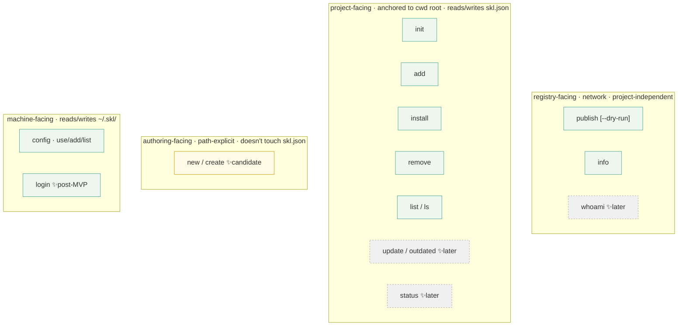
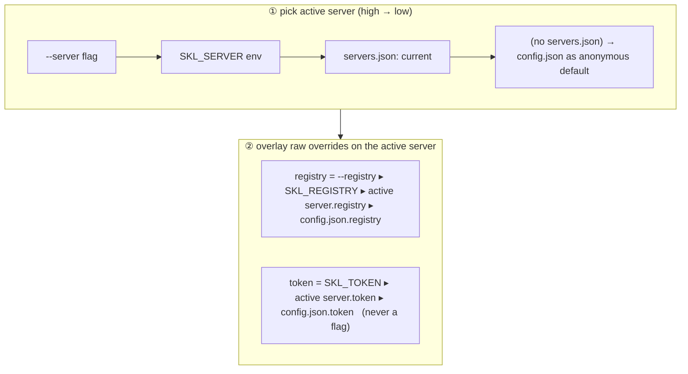
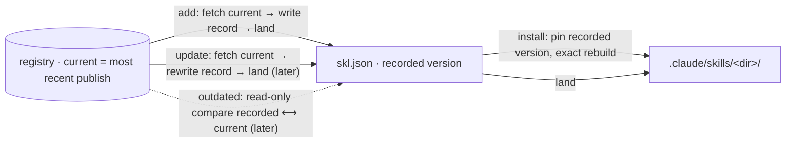

# CLI

> This is the detailed reference for the `skl` command line — what it looks like,
> how it's invoked, what each command's `--help` prints, what success and failure
> print, exit codes, and where config is read. Read
> [`../../skl/SKILL.md`](../../skl/SKILL.md) first for the mental model.
>
> **All user-facing CLI text (usage / help / output / errors) is English.**

## 0. Scope & design principles

1. **Thin shell.** The CLI holds no logic — it parses args & prompts, calls the core, writes results to disk / prints them, and reads the token.
2. **Two mindsets, never mixed.** *registry-facing* (`publish`/`info`, path-explicit, project-independent) vs. *project-facing* (`init`/`add`/`install`/`remove`/`list`/`scan`, anchored to the cwd project root). Command surface, errors, and help all organize along this line.
3. **Scriptable.** Single-person homelab, publishing runs in CI / on a Proxmox box. So every command runs **non-interactively**, has **stable exit codes**, and supports `--json`.
4. **Errors teach.** A failure hands you the next action (no `skl.json` for `install`/`remove` → suggest `skl init`; a landing-folder collision → point at `skl remove <conflicting skill>`).
5. **Don't build what Bun/libraries ship.** Framework **citty** (subcommands + auto help), prompts **@clack/prompts**.

## 1. Command surface

| Command | Aliases | Family | Network | Needs token | Needs `skl.json` | Status |
|---|---|---|---|---|---|---|
| `skl init` | — | project | no | no | creates it (re-run = reconfigure targets) | **MVP** |
| `skl publish <folder>` | `pub` | registry | yes | yes (write + namespace gate) | no | **MVP** |
| `skl add <name>` | `a` | project | yes (read) | yes | no (bootstraps one if absent; always records) | **MVP** |
| `skl install` | `i`, `in` | project | yes (read) | yes | yes (read all) | **MVP** |
| `skl remove <name>` | `rm`, `un`, `uninstall` | project | no | no | yes (gate) | **MVP** |
| `skl fork <name>` | — | registry | yes (write) | yes (write + namespace gate + verified email) | no | post-MVP |
| `skl info <name>` | `view`, `show` | registry | yes (read) | optional (public-browse; sent if present) | no | **MVP** |
| `skl list` | `ls` | project | no | no | yes (gate) | **MVP** |
| `skl scan` | — | project | yes (read; skipped offline) | reads | yes (read all) | post-MVP |
| `skl config [use\|add\|set\|rm\|ls]` | — | machine | no | no (stores pasted token, never mints) | no | **MVP** |
| `skl login <username>` | — | machine | yes (verify) | password → mints a device-bound key (or `--token` to paste) | no | post-MVP |
| `skl upgrade` | `up` | machine | yes (GitHub Releases) | no | no | post-MVP |
| `skl new <skill-name>` | — | authoring | no | no | no | candidate |
| `skl whoami` | — | service | yes | yes | no | later |
| `skl update` / `outdated` | — | project | yes | yes | yes | later |
| `skl status` | — | project | no | no | yes | later |

Aliases give npm muscle-memory a literal landing spot — each maps to exactly **one** canonical
command (no smart routing). Note skl splits npm's single `install` into two verbs: `add`/`a` adds a
new skill, while `install`/`i` re-lands everything from `skl.json` (the `npm ci` equivalent). So
`skl i <name>` does **not** add a skill — `install` takes no positional; use `skl a <name>`.

> `publish --dry-run` is a **flag** on `publish`, not a command. `skl login` (machine-facing, §3.9) shipped post-MVP — interactively it now **mints a device-bound key from your password** (ADR-0043), or stores a pasted token with `--token`/`--token-stdin`. `search` / `doctor` / MCP tools remain on the roadmap, out of scope here.



## 2. Global conventions (all commands)

### 2.1 Invocation & global flags

```
skl <command> [arguments] [options]
```

- `skl` (no command) → top-level help, exit `0`.
- `skl <command> --help` / `skl -h` / `skl help <command>` → command help, exit `0`.
- `skl --version` / `skl -v` → `skl <semver>`, exit `0`.

| Flag | Effect |
|---|---|
| `--registry <url>` | one-shot registry override (raw URL; top of the resolution ladder, §2.2) |
| `--server <name>` | use a named server from `~/.skl/servers.json` (host + token switched as a pair) |
| `--json` | machine-readable JSON output (no color, no spinner, §2.3) |
| `--no-color` | disable ANSI color (`NO_COLOR` env equivalent) |
| `-q, --quiet` | print only warnings and errors |
| `--verbose` | extra diagnostics (resolved server/registry/token source, per-file landing, …) |
| `--cwd <path>` | explicit project root (**still no walk-up**, just a different "current dir") |
| `-h, --help` | command help |
| `-v, --version` | version (top-level only) |

> **There is no `--token` flag.** A token on the command line leaks into shell history and the process list (`ps`). Tokens come only from `SKL_TOKEN` or `~/.skl/*`. `--server` / `--registry` are non-sensitive and may be flags.

### 2.2 Configuration resolution (multi-server)

AWS / kubectl style: **machine-level** credentials live under `~/.skl/`, and `skl.json` never holds a registry/token. skl calls "one backend = one registry URL + one token" a **server**; a machine can register several and switch between them.

**Two files, distinct jobs:**

```json
// ~/.skl/servers.json — multi-server (active server + named list)
{
  "current": "home",
  "servers": {
    "home": { "registry": "https://skl.loopdoop.dev", "token": "skl_aaaaaaaa" },
    "lan":  { "registry": "http://skl.lan:8787",        "token": "skl_bbbbbbbb" }
  }
}
```

```json
// ~/.skl/config.json — single-server simple form (kept for backward compatibility)
{ "registry": "https://skl.loopdoop.dev", "token": "skl_xxxxxxxx" }
```

- **If `servers.json` exists, use it** (source of truth for multi-server); otherwise fall back to `config.json` (old single-server form still works, zero migration).
- Each server entry pairs a `registry` (backend host URL) with a `token` (that server's own). They go **together** — a token is only valid against the backend that issued it.
- `current` is the **persistent active-server pointer**, rewritten by `skl config use <name>`.

**Resolution is two layers** — pick an active server, then overlay raw overrides:



- **Named switching** (`--server`/`SKL_SERVER`/`current`) is the daily path; **raw overrides** (`--registry`/`SKL_REGISTRY`/`SKL_TOKEN`) are the escape hatch for a one-off unregistered host (e.g. CI against a just-started service).
- `--server foo` with no `foo` in `servers.json` → error listing known server names.
- Only **network commands** require server/registry to resolve. A token is required for **publish** and to read **private** skills; `add`/`install` of a **public** skill work anonymously (ADR-0052 — a private entry 403s, so `add` prompts `skl login` and `install` skips it, exiting 0). `init` / `new` / `remove` / `list` / `status` read no credentials.
- **Security:** both files hold a plaintext token — `chmod 600` (documented, not enforced in the MVP).
- **`skl.json` still records no server** — the project manifest stays portable and credential-free. A server is the *environment*, the project is the *manifest*. See §8 of the `skl.json` design notes — the manifest must never contain a server or token.

### 2.3 Output contract

**Two modes:**

- **human (default, TTY):** color + symbols; stdout for data, stderr for progress/diagnostics; clack spinner for network round-trips.
- **`--json`:** stdout emits a **single JSON object** (success) or `{ "error": {...} }` (failure); no color, no spinner. Non-TTY still defaults to human (terse); structured output requires explicit `--json`.

**Symbol legend** (human): `✓` success (green) · `✗` error (red) · `⚠` warning (yellow) · `→` landing/points-to · `•` info/skip (dim). `--no-color` / non-TTY / `NO_COLOR` drops color, keeps symbols.

**Stream separation:** data → stdout (pipeable), logs/progress → stderr — so `skl list --json | jq` isn't polluted by progress.

`--json` success example (`skl add`):

```json
{ "ok": true, "command": "add", "name": "loopdoop/asc815-memo", "version": "2.3.1", "resolvedVersion": "2.3.1", "floating": false, "saved": true, "dir": "asc815-memo", "path": ".claude/skills/asc815-memo", "paths": [".claude/skills/asc815-memo", ".cursor/skills/asc815-memo"], "targets": ["claude", "cursor"] }
```

`--json` failure example:

```json
{ "ok": false, "error": { "code": "VERSION_EXISTS", "exit": 5, "message": "loopdoop/asc815-memo@2.3.1 already exists; versions are immutable" } }
```

### 2.4 Exit codes

| Code | Meaning | When |
|---|---|---|
| `0` | success (incl. `--dry-run`, `init` skip, no-op) | — |
| `1` | runtime error | network failure, fs failure, frontmatter/skl.json validation failure, sha mismatch |
| `2` | usage error | unknown command/flag, missing required arg, invalid name/target (citty backstop) |

**Semantic codes (proposal, CI-friendly):** subdivide `1` — `3` auth/config (no token / 401 / 403), `4` not-found (404), `5` conflict (409 version exists). CI's "skip publish if it already exists" can key on `5`. MVP may ship only `0/1/2` first.

### 2.5 TTY / non-interactive behavior

- **The interactive points:** `skl init`'s targets multiselect (also reached via `add` bootstrapping a manifest when none exists), and `add`'s pin-vs-latest question on a bare `add` (ADR-0009). Everything else is non-interactive.
- Non-TTY (CI / pipe): the targets question never hangs — no TTY behaves like `--yes` (strong detections, fallback `["claude"]`); `add` pins by default; other commands run normally.
- spinner/color auto-off on non-TTY.
- `add`'s landing-folder collision is a hard **error**, not an interactive prompt (no "overwrite?" dialog) — the fix is to `skl remove` the conflicting skill first, which keeps CI behavior predictable.

### 2.6 Error message style

One line "what failed" + (when useful) one line "how to fix," on stderr:

```
✗ <what failed>
  <how to fix — often a copy-pasteable command>
```

Example:

```
✗ No skl.json in this directory.
  Run `skl init` here first, or cd to your project root.
```

## 3. MVP commands

Each gives: synopsis · arguments · flags · behavior · full `--help` · sample output · error cases.

### 3.1 `skl init`

**What:** stands up `skl.json` in the cwd — the project-wide `targets` (which agents skills land into) + an empty `skills` array. The only command that creates `skl.json`. Re-running it on an existing valid manifest is the **reconfigure flow** (ADR-0013): re-scan, rewrite `targets` only. skl never touches git (ADR-0015).

**Args:** none. **Flags:** `--targets <csv>`, `-y`/`--yes`.

**Behavior:** cwd-anchored, no walk-up; writes `schemaVersion:1` + `targets` + empty `skills` array; deterministic serialization + atomic write. skl never reads or writes git state. **Targets resolution:** `--targets a,b` is explicit (an unknown id → `INVALID_TARGET`, exit 2, nothing written); otherwise init **scans for agents** (one readdir of the project root + one of `$HOME`, tiered strong/weak/machine) and, on a TTY, multi-selects across all six (strong detections pre-checked, evidence shown as hints, ≥ 1 required); `--yes` or no TTY accepts the strong detections, falling back to `["claude"]` when none (never hangs). After writing, init prints a **per-agent next-steps epilogue** (codex enable flag, cursor 2.4+ note, gemini precedence, grok beta gate). **Re-init = reconfigure:** an existing valid manifest is re-scanned with current targets ∪ strong detections pre-seeded, then only `targets` is rewritten — the `skills` array is preserved; a dropped root gets a stale warning pointing at `skl install --prune`. Corrupt manifest → error, no rewrite; no `--force`.

```text
skl init — Initialize skl.json (re-run on an existing project to reconfigure targets)

USAGE
  skl init [--targets <a,b,...>] [-y|--yes]

DESCRIPTION
  Creates ./skl.json in the current directory (no walk-up). This file marks
  the project root and records which agents (targets) every skill lands into.
  skl never reads or writes git state — whether skill files enter your repo is
  left to your own git handling.

  Fresh init asks which of the six supported agents to target (claude, codex,
  copilot, cursor, gemini, grok). init scans the project and your home
  directory for evidence of each agent; strongly-detected agents come
  pre-checked in the multiselect.

  Re-running init on an existing valid skl.json RECONFIGURES it: the
  multiselect is pre-seeded with the current targets plus any newly detected
  agents, and only "targets" is rewritten — the skills array is untouched. Run
  `skl install` afterwards to land skills into newly added roots (and
  `skl install --prune` to delete dirs under dropped roots).

OPTIONS
  --targets <a,b,...>    Comma-separated harness ids; skips the scan and the
                         multiselect. Unknown id → error, nothing written.
  -y, --yes              Accept the detected agents without prompting; falls
                         back to claude when nothing is detected.
  -h, --help             Show this help.

INTERACTIVE
  With a TTY: init multi-selects the targets (unless --targets is given).
  Without a TTY it never hangs: targets behave as --yes.

EXAMPLES
  skl init                                # pick agents (detected ones pre-checked)
  skl init --targets claude,cursor        # fully non-interactive (CI / scripts)
  skl init --yes                          # accept detection; fall back to claude
  skl init --targets claude,gemini        # re-init: rewrite targets only
```

Success / reconfigure / errors:

```
✓ Initialized ./skl.json (targets: claude, cursor)
  • Next steps:
  •   cursor: needs Cursor 2.4+; it also cross-reads .claude/skills/ and .agents/skills/.
```
```
✓ Updated targets: claude, gemini
  • Run `skl install` to land your skills into the new roots.
```
```
✓ Updated targets: claude
  • Run `skl install` to land your skills into the new roots.
⚠ Dropped roots: .cursor/skills — landed skill dirs there are now stale; run `skl install --prune` to delete them.
```
```
✗ Unknown target "bogus". Valid targets: claude, codex, copilot, cursor, gemini, grok.
```
```
✗ ./skl.json exists but is not valid JSON. Fix it by hand; init won't overwrite it.
```

### 3.2 `skl publish <folder>`

**What:** publishes a skill folder to the registry. Decoupled from `.claude/skills/` — it reads exactly the folder you point at.

**Args:** `folder` (required, contains `SKILL.md`). **Flags:** `--dry-run`, `--registry`.

**Behavior:** reads `<folder>/SKILL.md` and validates `name`/`description`/`metadata.version` **all required** locally; when `metadata.version` is the *only* thing missing, an interactive publish **offers to add `metadata.version: "1"`** to SKILL.md and continue (ADR-0028: a brand-new skill starts at `1`) (decline, `--json`, or `--dry-run` → the normal `MISSING_VERSION` error, no file written); `name` valid and not colliding with `col`; errors on symlink; packs the whole tree (denylist `.git`/`.DS_Store`/`node_modules`); **single upload** (no finalize); full name = `token.username` + `SKILL.md.name` (folder name not used); `(skill,version)` already exists → `409`, immutable — an interactive publish **offers to bump** `metadata.version` to the next suggestion (`1` → `2`, `0.1` → `0.2`) and retry (decline/non-TTY/`--json` → the plain exit-5 conflict).

```text
skl publish — Publish a skill folder to the registry

USAGE
  skl publish <folder> [--dry-run]

ARGUMENTS
  folder   Path to the skill folder (must contain SKILL.md). Independent of
           cwd and of .claude/skills/ — you publish exactly the folder you
           point at. The published full name is
           <your-username>/<name-in-SKILL.md>; the folder name is NOT used.

DESCRIPTION
  Reads <folder>/SKILL.md, validates its frontmatter, packs the whole skill
  tree, and uploads it in one request.

  Versioning is manual and immutable: metadata.version in SKILL.md is
  required, and each (skill, version) can be published only once. Re-publishing
  an existing version fails with a conflict — bump metadata.version first.
  (Same content under a new version number publishes fine; same version
  number with new content is rejected.)

  If SKILL.md has no metadata.version, an interactive publish offers to add
  metadata.version: "1" and continue. It only ever ADDS a version (never
  overwrites one — that would be an auto-bump). Declining, --json, or --dry-run
  surface the MISSING_VERSION error instead and leave the file untouched.

VALIDATED LOCALLY (before any upload)
  - SKILL.md frontmatter has name, description, and metadata.version
  - name is lower-case / hyphenated / <=64 and is not the reserved segment "col"
  - metadata.version is quoted in YAML (so "1.10" stays "1.10")
  - the folder contains no symlinks

OPTIONS
  --dry-run         Validate + pack + print what WOULD be published. No upload,
                    no token or network required.
  --registry <url>  Override the registry for this call.
  -h, --help        Show this help.

EXAMPLES
  skl publish ./my-skill
  skl publish ./.claude/skills/asc815-memo
  skl publish ./my-skill --dry-run
```

Success / dry-run / errors:

```
✓ Published loopdoop/asc815-memo@2.3.1  (7 files, 48.2 KB)
```
```
Dry run — nothing uploaded.
  Would publish:  loopdoop/asc815-memo@2.3.1
  Files: 7        Size: 48.2 KB
  ✓ frontmatter valid    ✓ no symlinks    ✓ name ok
```
```
✗ SKILL.md is missing metadata.version (required). Add e.g.  metadata.version: "1"
```
```
✗ Skill folder contains a symlink: scripts/run -> /usr/local/bin/run
  Remove it; skl won't follow or skip symlinks.
```
```
⚠ loopdoop/asc815-memo@2.3.1 already exists — versions are immutable.
? Bump metadata.version to "2.3.2" in SKILL.md and publish? (Y/n)
```
On an interactive TTY, `VERSION_EXISTS` first **offers to bump** `metadata.version` to the
next suggestion (last numeric segment +1: `1` → `2`, `0.1` → `0.2`, `2.3.1` → `2.3.2`) and re-runs the
whole flow on accept — versioning stays author-driven (ADR-0003): nothing is bumped without
consent. Decline, `--json`, a non-TTY run, or an unsuggestable version (e.g. `1.0-beta`)
falls through to the plain error:
```
✗ loopdoop/asc815-memo@2.3.1 already exists — versions are immutable.
  Bump metadata.version in SKILL.md and publish again.
```
```
✗ Authentication failed. Please log in again.
  Run `skl login` to re-authenticate.
```
```
✗ Refused (403): your token is for "alice" but you're publishing under "loopdoop/".
  You can only publish to your own namespace.
```

### 3.3 `skl add <name>`

**What:** installs a skill into **this project**, landing under `<root>/<dir>/` for every harness in the project-wide `targets` (e.g. `./.claude/skills/<dir>/`, `./.cursor/skills/<dir>/`), and records it in `skl.json`.

**Args:** `name` (full name `username/skill-name`, optional `@version`; omit `@version` to float to latest — there is no `@latest` suffix, ADR-0053). **Flags:** `--latest`, `--targets <csv>` (only used when bootstrapping a manifest). The harness set is **project-wide** (`skl.json` `targets`, default `["claude"]`), not a per-`add` flag.

**Always bootstraps + records (ADR-0015):** `add` always records the skill. When `skl.json` is **present**, it records into it. When **absent**, `add` first **bootstraps** a minimal manifest — prompting for which agents to target (the `init` multiselect), or taking `--targets <csv>` non-interactively (no-TTY falls back to detected agents ∪ `["claude"]`) — and then records. There is no `-s`/`--save`/`--no-save` and no ephemeral install path. The collision check runs against existing `skl.json` entries.

**Behavior:** strict cwd; downloads **once** (the **current** version, or the exact `@version` pin) via the service (S3 not exposed); re-checks sha256; unpack → collision check (`dir` = last segment, always; the folder used by **another full name** → hard `DIR_COLLISION` error) → adapter fan-out across every `targets` harness (pure identity copy — no frontmatter rewrite; identical `(root, dir)` outputs written once — codex+grok share `.agents/skills/`, ADR-0013) → **copy** landing (not symlink; atomic temp-dir swap per root) → atomic `skl.json` write-back. skl never touches git. Repeated `add` is idempotent. **Version recording (ADR-0009):** a bare `add` in an interactive run **asks** whether to *pin* the resolved version (reproducible) or track *`"latest"`* (floating); `@version` pins, a bare name / `--latest` floats (there is no `@latest` suffix — ADR-0053); non-interactive (`--json` / no TTY) **pins by default**.

```text
skl add — Install a skill into this project

USAGE
  skl add <name>[@<version>] [--latest] [--targets <a,b,...>]

ARGUMENTS
  name   Full skill name "username/skill-name", optionally suffixed:
           @<version>  pin and install that exact version
         With no suffix, add installs the current (most-recently-published)
         version and asks whether to pin it or track latest. There is no
         @latest suffix — omit @version (or pass --latest) to float.

DESCRIPTION
  Downloads the chosen version once and lands it under <root>/<dir>/ for
  every harness in skl.json's project-wide "targets" (e.g. .claude/skills/,
  .cursor/skills/), then records it in skl.json. Runs in the current
  directory only (no walk-up).

  add always records the skill. With no ./skl.json present, add first
  bootstraps one — prompting for the target agents (or taking --targets), the
  same flow as `skl init` — and then records the skill. skl never touches git.

  The landing folder is always the skill's last name-segment. Two skills whose
  names share a last segment can't coexist: the second add fails with a
  DIR_COLLISION error (remove the conflicting skill first).

  Files are copied, not symlinked. Re-running add on the same skill is
  idempotent: it refreshes the entry.

  Pinned vs latest: a pinned entry ("name@0.1") rebuilds byte-identically
  on every `skl install`. A floating entry (the bare "name") re-resolves to
  the current version each install — convenient, but NOT reproducible across
  machines (install warns). Interactive runs ask which you want; non-interactive
  runs pin by default (pass --latest to float).

  Note: "current version" = the most recent publish, not the highest version
  number. Because versions are author-assigned, a newer publish could
  carry a smaller number.

OPTIONS
  --latest            Record "latest" (floating) instead of pinning — skips the
                      prompt. (Floating is otherwise the default for a bare
                      name with no @version.)
  --targets <a,b,...> Comma-separated harness ids to bootstrap skl.json with
                      when none exists (skips the interactive agent prompt).
                      Ignored when a skl.json is already present.
  -h, --help          Show this help.

  The harness(es) to land into are project-wide: skl.json's "targets"
  (claude/codex/copilot/cursor/gemini/grok), set by `skl init` (or bootstrapped
  by add when no manifest exists) and hand-editable — not a per-add flag. add
  downloads once and lands the skill into every harness in that array (shared
  roots written once: codex and grok both use .agents/skills/).

EXAMPLES
  skl add loopdoop/asc815-memo            # install + record (bootstraps skl.json if none; asks pin/latest)
  skl add loopdoop/asc815-memo --targets claude,cursor  # bootstrap targets non-interactively, then record
  skl add loopdoop/asc815-memo@2.3.1      # pin exactly 2.3.1
  skl add loopdoop/asc815-memo --latest   # track "latest" (floating)
```

Success / collision / others:

```
✓ Installed loopdoop/asc815-memo@2.3.1 → ./.claude/skills/asc815-memo/, ./.cursor/skills/asc815-memo/  (pinned 2.3.1)
```
```
✓ Installed tanker/x-tract@0.2 → ./.claude/skills/x-tract/  (tracking latest (now 0.2))
```
```
✗ The landing folder "asc815-memo/" is already used by loopdoop/asc815-memo.
  Two skills can't share a folder name. Remove loopdoop/asc815-memo first:
    skl remove loopdoop/asc815-memo
```
```
✗ Skill not found (404): loopdoop/nope
```
```
✗ Download integrity check failed (sha mismatch). Nothing was written.
```

### 3.4 `skl install`

**What:** rebuilds every skill in `skl.json` — **pinned** entries at their exact recorded version (the `npm ci` equivalent); **`"latest"`** entries re-resolved to the current version (with a warning). Also the **reconciliation point** for target edits (ADR-0013): it warns about skl-managed dirs stranded under roots no longer in `targets`, and `--prune` deletes them.

**Args:** none. **Flags:** `--prune`.

**Behavior:** requires `skl.json` in cwd, reads all; per entry **one** fetch of the **recorded version** (`GET /skills/:u/:n/:version/tarball`) for a pin, or the **current** version for a `"latest"` entry → sha check → unpack → adapter fan-out across the project-wide `targets` (deduped roots) → copy landing into each root. No walk-up. Floating entries make the rebuild non-reproducible, so install prints a warning naming how many. **Stale-root reconciliation:** after the rebuild, any manifest-managed `<root>/<dir>/` found under a known landing root that is **not** a current target is warned about (with the `--prune` instruction); `--prune` deletes exactly those dirs, reporting each. Deletion is **never silent**.

```text
skl install — Rebuild all skills from skl.json (npm ci equivalent)

USAGE
  skl install [--prune]

DESCRIPTION
  Reads ./skl.json and re-lands every recorded skill into every target's
  landing root. A PINNED entry ("name@0.1") is re-landed at that EXACT
  version — the equivalent of `npm ci`. A FLOATING entry (the bare "name")
  is re-resolved to the current registry version each run (install warns,
  since that isn't reproducible across machines). Use it to reconstruct a
  project on another machine or checkout, and after editing "targets" (via
  `skl init` or by hand) to land skills into the new roots.
  Requires ./skl.json (run `skl init` first). No walk-up.

  Skill dirs that skl previously landed under a root that is NO LONGER in
  targets are reported as stale, never deleted automatically — pass --prune
  to delete them.

OPTIONS
  --prune      Delete skl-managed skill dirs found under roots that are no
               longer in skl.json targets.
  -h, --help   Show this help.

EXAMPLES
  skl install
  skl install --prune   # also delete stale dirs under dropped roots
```

Success / stale / errors:

```
Installing 3 skills from ./skl.json …
  ✓ loopdoop/asc815-memo@2.3.1   → .claude/skills/asc815-memo/, .cursor/skills/asc815-memo/
  ✓ otheruser/asc815-memo@0.1    → .claude/skills/asc815-memo-otheruser/, .cursor/skills/asc815-memo-otheruser/
  ✓ loopdoop/hono-helper@1.2.0   → .claude/skills/hono-helper/, .cursor/skills/hono-helper/
✓ Rebuilt 3 skills.
```
```
⚠   Stale: ./.cursor/skills/demo/ is skl-managed but its root is not in targets.
⚠ Stale dirs are never deleted automatically — run `skl install --prune` to delete them.
```
```
✓   Pruned ./.cursor/skills/demo/        # with --prune
```
```
✗ No skl.json in this directory. Run `skl init` here first.
```
```
✗ loopdoop/hono-helper@1.2.0 is no longer in the registry (404). Skipped.
  (3 of 3 attempted, 1 failed.)   # exit code 1
```

`--json` adds `stale` (the `<root>/<dir>` list found) and `pruned` (count deleted) to the result object.

### 3.5 `skl remove <name>`

**What:** deletes the skill's landed dir from **all known landing roots** — not just current targets (ADR-0013: a root edited out of `targets` after landing still gets cleaned) — and drops it from `skl.json`. Local only. Safe by construction: only the skill's last-name-segment folder is ever deleted under a root. skl never touches git.

**Args:** `name` (full name as recorded in `skl.json`).

```text
skl remove — Remove a skill from this project

USAGE
  skl remove <name>

ARGUMENTS
  name   Full skill name "username/skill-name" as recorded in skl.json.

DESCRIPTION
  Deletes the skill's landed dir from every known landing root (all six
  harnesses' roots, whether or not they are current targets — so a copy
  stranded under a former target is cleaned too) and drops its entry from
  ./skl.json. Local only — no network, no token. Requires ./skl.json.

OPTIONS
  -h, --help   Show this help.

EXAMPLE
  skl remove loopdoop/asc815-memo
```

Success / error:

```
✓ Removed loopdoop/asc815-memo
  • Deleted ./.claude/skills/asc815-memo/
  • Deleted ./.cursor/skills/asc815-memo/
  • Updated ./skl.json
```
```
✗ loopdoop/asc815-memo is not in skl.json — nothing to remove.
```

### 3.6 `skl info <name>`

**What:** shows a skill's **registry-side** details and available versions. Distinct from `skl list` ("what this project installed").

**Auth:** token-optional — a **public** skill's detail is served session-optional (ADR-0017 public-browse), so `skl info` works **logged out** (it reads anonymously). A stored token is still sent when present, so an owner can `info` their own **private** skills. A private/unknown skill read by a logged-out (or non-recipient) caller returns 404/403 with no existence leak.

**Args:** `name` (full name). **Flags:** `--json`.

```text
skl info — Show a skill's registry details

USAGE
  skl info <name>

ARGUMENTS
  name   Full skill name "username/skill-name".

DESCRIPTION
  Fetches one skill's details from the registry: description, current version
  (most recent publish), and the list of published versions. This is the
  REGISTRY view of one skill — to see what THIS project has installed, use
  `skl list`.

OPTIONS
  --json       Emit a JSON object instead of formatted text.
  -h, --help   Show this help.

EXAMPLE
  skl info loopdoop/asc815-memo
```

Success / error:

```
loopdoop/asc815-memo
  Use when reconciling ASC 815 hedge accounting memos and tie-outs.
  Current:  2.3.1   (published 2026-05-30)
  Versions: 0, 0.1, 1.0.0, 2.3.1
```
```
✗ Skill not found (404): loopdoop/nope
```

### 3.7 `skl list` / `skl ls`

**What:** reads `skl.json`, prints **what this project installed**. Local only. Fills the gap where `info` is registry-side and the agent MCP has `list_installed` but humans lacked a CLI equivalent.

```text
skl list — List skills installed in this project   (alias: skl ls)

USAGE
  skl list [--json]

DESCRIPTION
  Reads ./skl.json and prints what THIS project has installed: full name,
  recorded version, and landing dir (the skill's last name-segment). The
  project-wide targets are shown once in the summary line (not a per-row
  column). Local only. Requires ./skl.json. For the registry view of one
  skill, use `skl info`.

OPTIONS
  --json       Emit the entries as JSON.
  -h, --help   Show this help.
```

Output:

```
3 skills in ./skl.json (targets=claude)
  NAME                     VERSION  DIR
  loopdoop/asc815-memo     2.3.1    asc815-memo
  tanker/x-tract           latest   x-tract
  loopdoop/hono-helper     1.2.0    hono-helper
```

### 3.8 `skl config` (server management)

**What:** reads/writes `~/.skl/servers.json` — register named servers, switch the active pointer, show the effective config (§2.2). **Boundary:** `skl config` only **stores a token you paste** (the advanced / self-hosted path); the normal way to authenticate is **`skl login`**, which mints a device-bound key for you (ADR-0043). The web UI lists and revokes devices but no longer mints keys. Tokens are entered via a hidden prompt or `--token-stdin`, **never a flag**.

```text
skl config — Manage backend servers and show the effective configuration

USAGE
  skl config                               Show the active server + config
  skl config list                          List defined servers       (alias: ls)
  skl config use <name>                    Switch the active (current) server
  skl config add <name> --registry <url>   Define a server (prompts for token)
  skl config set <name> [--registry <url>] Update a server's fields
  skl config rm  <name>                    Delete a server profile

DESCRIPTION
  Reads and writes ~/.skl/servers.json — your named backends, each pairing a
  registry URL with its token, plus a "current" pointer. The legacy single-
  server ~/.skl/config.json still works as a fallback when servers.json is
  absent.

  skl config stores a token you paste; it does not mint one. The normal way to
  authenticate is `skl login`, which mints a device-bound key and stores it for
  you (ADR-0043) — pasting a token here is the advanced / self-hosted path. The
  web UI lists and revokes devices but no longer mints keys. Tokens are entered
  via a hidden prompt or --token-stdin, never a flag. Keep ~/.skl/servers.json
  at chmod 600.

OPTIONS (for add / set)
  --registry <url>   The server's backend URL.
  --token-stdin      Read the token from stdin (for CI) instead of prompting.
  --json             Machine-readable output (show / list).
  -h, --help         Show this help.

EXAMPLES
  skl config                                   # who am I pointed at?
  skl config add lan --registry http://skl.lan:8787
  skl config use lan
  skl config list
  echo "$TOKEN" | skl config add ci --registry https://skl.loopdoop.dev --token-stdin
```

Display / list / mutations / errors:

```
Active server: lan
  registry  http://skl.lan:8787
  token     skl_bbbb…  (from ~/.skl/servers.json)
```
```
2 servers (* = current)
  * lan    http://skl.lan:8787        skl_bbbb…
    home   https://skl.loopdoop.dev   skl_aaaa…
```
```
✓ Active server → home  (https://skl.loopdoop.dev)
```
```
? Paste the token for "lan": ********
✓ Added server "lan" → http://skl.lan:8787
  Run `skl config use lan` to make it active.
```
```
✗ No server named "prod". Known: home, lan.
```

### 3.9 `skl login <username>`

**What:** the one-step way to authenticate. **Default (interactive):** prompts for the account **password**, signs in to Better Auth, and **mints a device-bound `skl_…` API key** (ADR-0043) — only the minted key is stored, never the password. **Token mode** (`--token` to paste interactively, `--token-stdin` for CI) instead stores a token you already have (e.g. minted elsewhere); like `config`, that path stores-only and binds nothing. Either way `login` then calls `GET /me` to **confirm the credential belongs to `<username>`** and stores `{ token[, registry] }` in `~/.skl/servers.json` under the active server (registry omitted when it is the hosted default `https://useskl.com`), so `skl publish` works immediately. **Device binding (ADR-0043):** the minted key is bound to this machine via `md5(hostname)`; every later CLI request sends `x-skl-sn` and the server **403 `DEVICE_MISMATCH`** rejects a `servers.json` copied to another machine — the CLI then tells you to run `skl login` here again. Secrets are entered via a hidden prompt or `--token-stdin`, **never a flag**; `<username>` is optional (prompted if omitted). No registry prompt — it defaults to `https://useskl.com`. Shipped post-MVP.

```text
skl login — Verify a token against a server and store it (makes it active)

USAGE
  skl login [username] [--registry <url>] [--token-stdin]

DESCRIPTION
  Prompts for the <username> if you omit it, resolves the registry (--registry
  > SKL_REGISTRY > active server) — and if none is configured, prompts for it
  too (default http://localhost:8787) — then prompts for the token (or reads
  --token-stdin), verifies it via GET /me, and writes {registry, token} to
  ~/.skl/servers.json under server name = <username>, set as current. So a
  first-time login is a self-contained username → registry → token flow.

  The <username> and registry prompts fire only in an interactive run: in --json
  mode or with --token-stdin (stdin is the token pipe, CI has no TTY) the
  username must be an argument (else exit 2) and the registry must come from
  --registry/env/config (else exit 3).

  Fails (exit 3) if the token belongs to a different user than <username>, or
  if the server rejects it (401). Nothing is stored on a failed login.

  skl stores tokens you paste; it never generates or revokes them. Keep
  ~/.skl/servers.json at chmod 600.

OPTIONS
  --registry <url>   Server URL (optional — prompts if omitted and none is
                     configured; the prompt defaults to http://localhost:8787).
  --token-stdin      Read the token from stdin (for CI) instead of prompting.
  --json             Machine-readable result.
  -h, --help         Show this help.

EXAMPLES
  skl login alice --registry https://skl.loopdoop.dev   # prompts for the token
  skl login alice                                        # reuse the active registry
  skl login                                              # prompts for username, registry, then token
  echo "$TOKEN" | skl login ci --registry https://skl.lan:8787 --token-stdin
```

Success / mismatch / rejection:

```
? Paste the token for "alice": ********
✓ Logged in as alice → https://skl.loopdoop.dev
  `skl publish` will use this server.
```
```
✗ That token belongs to "bob", not "alice".
```
```
✗ Authentication failed. Please log in again.
  Run `skl login` to re-authenticate.
```

### 3.10 `skl scan`

**What:** a **read-only** health check for this project's skills — the local precursor to a future `doctor`. Reads `skl.json` (required) and inspects the landed skill folders under the project's `targets` roots, then reports drift in five buckets and ends with a stats summary. It **mutates nothing**: for an orphan it prints the follow-up command to run, it never runs it. Project-facing; needs a token only for the registry section (skipped gracefully without one).

A landed folder is considered "tracked" only when it carries a `.skl` file (ADR-0014); folders without one are loose and ignored. Drift is detected by re-running the publish analyzer over each folder and comparing the fresh content **digest** against the `digest` recorded in its `.skl` — `.skl` itself is excluded from the digest, so the comparison is stable.

**Buckets:** ① **Modified** — a declared+installed folder whose recomputed digest differs from its `.skl` (local edits → a publish candidate); ② **Registry** — *update available* (the registry's current version differs from the installed version) and *unavailable* (the skill is now private to another user → 403, or deleted → 404); ③ **Missing**, both directions — declared in `skl.json` but not installed, and installed (with a `.skl`) but not declared; ④ **Orphans** — the installed-but-not-declared set, each with a suggested `skl publish` command; ⑤ **Summary** — counts of every bucket.

**Caveat:** an orphan's `.skl` records only a `<userId>:<skillId>` id, not a `username/skill-name`, so scan **cannot** check the registry status of orphans — only declared skills get remote checks.

**Args:** none. **Flags:** `--offline` (skip the registry checks for a fast local-only scan), `--json`.

```text
skl scan — Check the health of this project's skills (read-only)

USAGE
  skl scan [--offline] [--json]

DESCRIPTION
  Reads ./skl.json and inspects the landed skill folders under this project's
  targets. Reports, each section only when non-empty: skills modified since
  publish (digest drift), updates available / unavailable on the registry,
  skills missing in either direction (declared-not-installed and
  installed-not-declared), and orphan folders — then a summary of the counts.

  Read-only: scan never writes skl.json, never lands or removes a skill, and
  for orphans only PRINTS the `skl publish` command to run. Registry checks run
  by default and degrade gracefully — without a token, or with --offline, the
  registry section is skipped with a warning. Requires ./skl.json.

OPTIONS
  --offline    Skip the registry checks (local-only scan).
  --json       Emit the structured report instead of formatted text.
  -h, --help   Show this help.

EXAMPLES
  skl scan                 # full health check
  skl scan --offline       # fast, local-only (no registry calls)
  skl scan --json | jq     # structured report for scripting
```

Output (issues found) and the clean case:

```
⚠ Modified (local edits — candidate for publish/save)
  • loopdoop/asc815-memo  (.claude/skills/asc815-memo)
⚠ Updates available
  • tanker/x-tract  1.0.0 → 1.2.0
⚠ Unavailable
  • loopdoop/secret  (private — no access)
⚠ Missing
  In skl.json but not installed:
    • loopdoop/hono-helper
    → run `skl install` to land them
  Installed but not in skl.json: 1 (see Orphans below)
⚠ Orphans (tracked folders not in skl.json)
  • .claude/skills/loose-skill
    → skl publish ./.claude/skills/loose-skill  (or add it to skl.json)

Summary
  4 declared · 4 installed · 1 up-to-date · 1 modified · 1 updatable · 1 unavailable · 1 not-installed · 1 orphan
```
```
✓ All skills are in sync.

Summary
  3 declared · 3 installed · 3 up-to-date · 0 modified · 0 updatable · 0 unavailable · 0 not-installed · 0 orphans
```

Scan is a **diagnostic**: finding issues is informational, so it still exits `0`. A missing or corrupt `skl.json` is the only hard error (exit 1). `--json` emits `{ ok: true, command: "scan", remoteChecked, modified, updates, unavailable, declaredNotInstalled, orphans, upToDate, stats }`.

### 3.11 `skl upgrade` / `skl up`

**What:** update the installed `skl` binary to the latest release. The binary knows its own
version (injected from the git tag at build time; `0.0.0` in a dev build) but **not** how it was
installed (ADR-0050 ships four channels). `upgrade` resolves the latest release from the public
**GitHub Releases API** (`releases/latest` — the same source `install.sh` uses, no auth), and if the
binary is behind, **detects the install method** from the resolved real path of the running binary
and performs the matching upgrade. Machine-facing; no token, no `skl.json` (ADR-0051).

**Behavior:** a dev build (version `0.0.0`) refuses up front (exit 1) — only an installed release can
self-upgrade. Already-current → reports and exits `0`. When behind, the install-method dispatch is:
**Homebrew** (real path under `…/Cellar/…`) → `brew upgrade loopdoop/tap/skl`; **npm** (under
`…/node_modules/…`) → `npm install -g useskl@latest`; **apt/dpkg** (`/usr/bin/skl`) → **advisory only**
(prints the `.deb` download + `dpkg -i` step — the hosted apt repo is deferred, ADR-0050 §7);
**direct / curl** (anything else, e.g. `/usr/local/bin`, `~/.local/bin`) → re-runs the published
`install.sh` pinned to the current binary's dir (`SKL_INSTALL_DIR`) and the resolved tag
(`SKL_VERSION`), reusing its platform-detect, frozen asset names, checksum verify, and atomic
replace. A non-writable install dir → exit 1 with a `sudo` / `SKL_INSTALL_DIR` hint. After a
successful upgrade it best-effort re-reads `--version` to confirm.

**Args:** none. **Flags:** `--check` (report whether a newer version exists, change nothing), `--json`.
Env overrides (self-hosting / tests): `SKL_RELEASES_API`, `SKL_INSTALL_URL`.

```text
skl upgrade — Update skl to the latest release

USAGE
  skl upgrade [--check] [--json]

DESCRIPTION
  Checks the latest skl release (GitHub Releases) and, if this binary is behind,
  upgrades it via the channel it was installed from: Homebrew (brew upgrade), npm
  (npm install -g), or a direct/curl install (re-runs install.sh in place). An
  apt/dpkg install prints the manual .deb step. A dev build refuses.

OPTIONS
  --check      Only report whether a newer version exists (no changes).
  --json       Emit a structured result instead of formatted text.
  -h, --help   Show this help.

EXAMPLES
  skl upgrade            # upgrade to the latest release
  skl upgrade --check    # report current vs latest, change nothing
  skl up --json | jq     # structured result for scripting
```

`--json` emits `{ ok: true, command: "upgrade", current, latest, method, upgraded, … }`
(`updateAvailable` on `--check`; `installed` after a successful upgrade). Failure to reach the
release source → exit 1 (`UPGRADE_CHECK_FAILED`); a failed upgrade subprocess → exit 1
(`UPGRADE_FAILED`); a non-writable dir → exit 1 (`UPGRADE_NOT_WRITABLE`); a dev build → exit 1
(`DEV_BUILD`).

## 4. Candidate / later commands (help sketches)

These are not MVP; listed so the surface is coherent.

- **`skl new <skill-name>` (alias `create`)** — scaffold a skill folder with valid pre-filled frontmatter (`name`/`description`/`metadata.version`), killing "missing version / illegal name" publish errors at the source. Authoring-facing: path-explicit, doesn't touch `skl.json`. Accepts a **bare** skill-name (namespace added from the token at publish).
- **`skl whoami`** — `GET /me`: prints `username` · effective registry · token source. Fastest namespace-403 diagnosis.
- **`skl outdated` / `skl update [name]`** — `outdated` compares each entry's recorded version vs. the current publish (criterion: "recorded ≠ current," not highest semver); `update` re-resolves to current, re-lands, and rewrites the `skl.json` record.
- **`skl status`** — reports drift between `skl.json` and disk (missing landings, untracked landings, version mismatches). The local, read-only precursor to a future `doctor`. **Shipped as [`skl scan`](#310-skl-scan)** — which also adds digest-drift detection and the registry update/unavailable checks.

## 5. Version advancement (recorded vs. current)



In one line: **exact rebuild** (new machine) → `install` (pins recorded version); **deliberate upgrade** to the latest publish → re-run `add` (or the future `update`).

## 6. Top-level help (`skl --help`)

```text
skl — cross-harness skill distribution & management

USAGE
  skl <command> [arguments] [options]

COMMANDS
  init                  Initialize skl.json (re-run to reconfigure targets)
  publish <folder>      Publish a skill folder to the registry
  add <name>            Install a skill into this project
  install               Rebuild all skills from skl.json (npm ci equivalent)
  remove <name>         Remove a skill from this project
  info <name>           Show a skill's registry details
  list                  List skills installed in this project
  scan                  Check the health of this project's skills (read-only)
  config                Manage backend servers / show effective config
  login <username>      Verify a token and store it (makes it active) (post-MVP)
  new <skill-name>      Scaffold a new skill folder                  (candidate)

GLOBAL OPTIONS
  --server <name>       Use a named server from ~/.skl/servers.json
  --registry <url>      Ad-hoc registry URL (overrides server + SKL_REGISTRY)
  --cwd <path>          Treat <path> as the project root (no walk-up)
  --json                Machine-readable JSON output
  --no-color            Disable colored output (or set NO_COLOR)
  -q, --quiet           Print only warnings and errors
  --verbose             Print extra diagnostic detail
  -v, --version         Print skl version
  -h, --help            Show help

CONFIG
  A "server" pairs a registry URL with its token. Manage named servers with
  `skl config` (use/add/list/...). Resolution, highest first:
    server:    --server flag · SKL_SERVER env · servers.json "current"
               · config.json (legacy single server)
    registry:  --registry flag · SKL_REGISTRY env · active server · config.json
    token:     SKL_TOKEN env · active server · config.json   (never a flag)
  Keep ~/.skl/servers.json and ~/.skl/config.json at chmod 600 (plaintext token).

PROJECT VS REGISTRY
  Project commands (init/add/install/remove/list/scan) run in the current
  directory only; install/remove/list/scan require a skl.json (add bootstraps
  one if absent and always records). Registry commands (publish/info) are path-
  or name-explicit and don't touch your project.

Run `skl <command> --help` for command-specific help.
```

## 7. Settled CLI decisions

- **Output language English** — all CLI text English; these docs are English too.
- **No `--token` flag** — token only from `SKL_TOKEN` / `~/.skl/*`, to avoid leaking into shell history / process list. `--registry` may be a flag (non-sensitive).
- **Exit-code semantics** — MVP `0/1/2` first; CI-friendly `3` auth / `4` not-found / `5` conflict as optional increments.
- **`targets` is project-wide** — `skl.json`'s top-level `targets` array (six harness ids per ADR-0013, set by `init`'s detection-assisted multiselect and reconfigured by re-running `init`), not a per-`add` flag; `add`/`install` download once and land into every harness in it, with shared roots written once (codex+grok). Stale roots are reconciled by `install` (warn) / `install --prune` (delete); `remove` sweeps all known roots.
- **`--cwd`** — "change current dir, still no walk-up." Preserves strict-cwd discipline.
- **Multi-server config** — `~/.skl/servers.json` + `current`; `--server`/`SKL_SERVER` one-shot, `skl config use` persistent; `config.json` single-server fallback. `config` never mints/revokes (stores pasted tokens); `skl login` mints a device-bound key from your password (ADR-0043), and the web revokes (device list).
- **`skl.json` records no server** — server is machine-level environment; the manifest stays portable.
