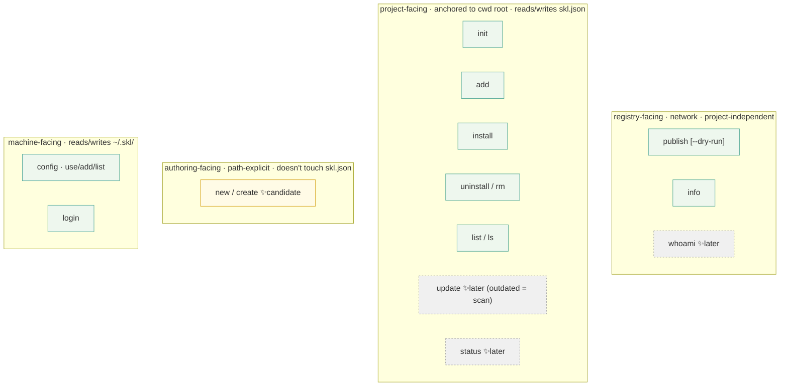
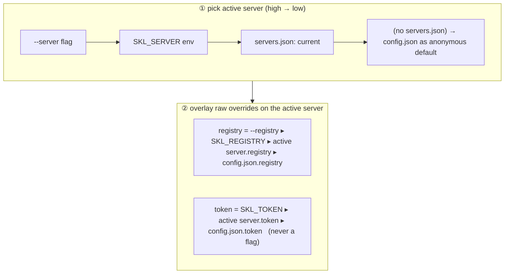
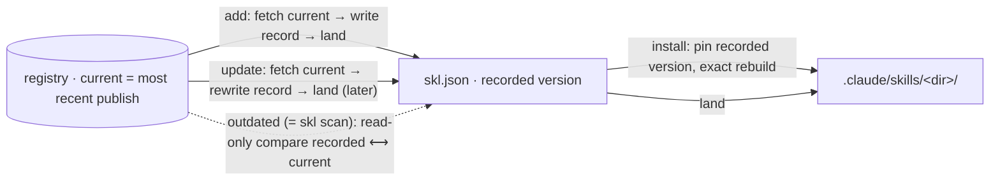

# CLI

> This is the detailed reference for the `skl` command line — what it looks like,
> how it's invoked, what each command's `--help` prints, what success and failure
> print, exit codes, and where config is read. Read
> [`../../skl/SKILL.md`](../../skl/SKILL.md) first for the mental model.
>
> **All user-facing CLI text (usage / help / output / errors) is English.**

## Table of contents

- [0. Scope & design principles](#0-scope--design-principles)
- [1. Command surface](#1-command-surface)
- [2. Global conventions (all commands)](#2-global-conventions-all-commands)
  - [2.1 Invocation & global flags](#21-invocation--global-flags)
  - [2.2 Configuration resolution (multi-server)](#22-configuration-resolution-multi-server)
  - [2.3 Output contract](#23-output-contract)
  - [2.4 Exit codes](#24-exit-codes)
  - [2.5 TTY / non-interactive behavior](#25-tty--non-interactive-behavior)
  - [2.6 Error message style](#26-error-message-style)
- [3. Commands](#3-commands)
  - [3.1 `skl init`](#31-skl-init)
  - [3.2 `skl publish <folder>`](#32-skl-publish-folder)
  - [3.2a `skl save <folder>`](#32a-skl-save-folder)
  - [3.3 `skl add <name|github-url>`](#33-skl-add-namegithub-url)
  - [3.4 `skl install [<name>]`](#34-skl-install-name)
  - [3.5 `skl uninstall <name>`](#35-skl-uninstall-name-aliases-remove-rm)
  - [3.6 `skl info <name>`](#36-skl-info-name)
  - [3.7 `skl list` / `skl ls`](#37-skl-list--skl-ls)
  - [3.8 `skl config`](#38-skl-config-server-management)
  - [3.9 `skl login <username>`](#39-skl-login-username)
  - [3.10 `skl logout [username]`](#310-skl-logout-username)
  - [3.11 `skl scan` (alias `outdated`)](#311-skl-scan-alias-outdated)
  - [3.12 `skl upgrade` / `skl up`](#312-skl-upgrade--skl-up)
- [4. Candidate / later commands](#4-candidate--later-commands-help-sketches)
- [5. Version advancement (recorded vs. current)](#5-version-advancement-recorded-vs-current)
- [6. Top-level help (`skl --help`)](#6-top-level-help-skl---help)
- [7. Settled CLI decisions](#7-settled-cli-decisions)

## 0. Scope & design principles

1. **Thin shell.** The CLI holds no logic — it parses args & prompts, calls `core`, writes `core`'s results to disk / prints them, and reads the token (architecture §5).
2. **Two mindsets, never mixed.** *registry-facing* (`publish`/`save`/`info`, path-explicit, project-independent) vs. *project-facing* (`init`/`add`/`install`/`uninstall`/`list`/`scan`, anchored to the cwd project root). Command surface, errors, and help all organize along this line.
3. **Scriptable.** Single-person homelab, publishing runs in CI / on a Proxmox box. So every command runs **non-interactively**, has **stable exit codes**, and supports `--json`.
4. **Errors teach.** A failure hands you the next action (no `skl.json` for `install`/`uninstall` → suggest `skl init`; a landing-folder collision → point at `skl uninstall <conflicting skill>`).
5. **Don't build what Bun/libraries ship.** Framework **citty** (subcommands + auto help), prompts **@clack/prompts**.

## 1. Command surface

| Command | Aliases | Family | Network | Needs token | Needs `skl.json` |
|---|---|---|---|---|---|
| `skl init` | — | project | no | no | creates it (re-run = reconfigure targets) |
| `skl publish <folder>` | `pub` | registry | yes | yes (write + namespace gate) | no |
| `skl save <folder>` | — | registry | yes | yes (write + namespace gate) | no |
| `skl install [<name\|github-url>]` | `i`, `in`, `a`, `add` | project | optional (GitHub `--local` needs none) | yes | bare: yes (read all); arg: bootstraps one if absent + records |
| `skl uninstall <name>` | `remove`, `rm`, `un`, `r` | project | no | no | yes (gate) |
| `skl info <name>` | `view`, `show` | registry | yes (read) | optional (public-browse; sent if present) | no |
| `skl list` | `ls`, `la`, `ll` | project | no | no | yes (gate) |
| `skl scan` | `outdated` | project | yes (read; skipped offline) | reads | yes (read all) |
| `skl config [use\|add\|set\|rm\|ls]` | `c` | machine | no | no (stores pasted token, never mints) | no |
| `skl login [username]` | `adduser`, `add-user` | machine | yes (verify) | password, `--code` (website pairing code, for GitHub/Google), or `--token` to paste → device-bound key | no |
| `skl logout [username]` | — | machine | no | no (forgets the stored login) | no |
| `skl upgrade` | `up` | machine | yes (GitHub Releases) | no | no |

Aliases mirror npm's own shortcuts (`remove`/`rm`/`un`/`r`, `la`/`ll`, `c`, `adduser`, `outdated`) so
npm muscle-memory lands; each maps to exactly **one** canonical command. The removal verb is
**`uninstall`** (npm's name); `remove`/`rm`/`un`/`r` are its aliases. **`install` is the one install
verb; `add`/`a` are aliases of it** (ADR-0071): `skl install <name>` adds one skill (it routes the
positional to the add logic, ADR-0058) and **bare** `install`/`i` re-lands everything from `skl.json`
(the `npm ci` equivalent) — so `skl add foo/bar` installs one and bare `skl add` rebuilds. Two
deliberate npm divergences: there is no `update`→`upgrade` alias (skl's `upgrade` self-updates the
**CLI binary**, ADR-0051, not skills), and `scan`/`outdated` reports a **broader** health check than
npm's version-only `outdated`. See the **npm cheat sheet**.

> `publish --dry-run` is a **flag** on `publish`, not a command. `skl login` (machine-facing, §3.9) interactively **mints a device-bound key from your password** (ADR-0043), or stores a pasted token with `--token`/`--token-stdin`. `search` / `doctor` / MCP tools remain on the roadmap, out of scope here.


```mermaid
flowchart TB
    subgraph reg["registry-facing · network · project-independent"]
        PUB["publish [--dry-run]"]
        INFO["info"]
        WHO["whoami ✨later"]
    end
    subgraph proj["project-facing · anchored to cwd root · reads/writes skl.json"]
        INIT["init"]
        ADD["add"]
        INST["install"]
        RM["uninstall / rm"]
        LS["list / ls"]
        UPD["update ✨later (outdated = scan)"]
        STAT["status ✨later"]
    end
    subgraph auth["authoring-facing · path-explicit · doesn't touch skl.json"]
        NEW["new / create ✨candidate"]
    end
    subgraph mach["machine-facing · reads/writes ~/.skl/"]
        CFG["config · use/add/list"]
        LOGIN["login"]
    end

    classDef done fill:#eef7ee,stroke:#5a9;
    classDef cand fill:#fffbe6,stroke:#d4a017;
    classDef park fill:#f0f0f0,stroke:#aaa,stroke-dasharray:3 3;
    class INIT,ADD,INST,RM,INFO,PUB,LS,CFG,LOGIN done;
    class NEW cand;
    class WHO,UPD,STAT park;
```

## 2. Global conventions (all commands)

### 2.1 Invocation & global flags

```
skl <command> [arguments] [options]
```

- `skl` (no command) → top-level help, exit `0`.
- `skl <command> --help` / `skl <command> -h` → command help, exit `0`. (There is no `help` subcommand — `skl help <command>` is not recognized.)
- `skl --version` / `skl -v` → `skl <semver>`, exit `0`.

| Flag | Effect |
|---|---|
| `--registry <url>` | one-shot registry override (raw URL; top of the resolution ladder, §2.2) — **advanced; hidden from `--help`** |
| `--server <name>` | use a named server from `~/.skl/servers.json` (host + token switched as a pair) — **advanced; hidden from `--help`** |
| `--json` | machine-readable JSON output (no color, no spinner, §2.3) |
| `--no-color` | disable ANSI color (`NO_COLOR` env equivalent) |
| `-q, --quiet` | suppress progress chatter and secondary `•` info lines; keep the final `✓` result line plus warnings/errors |
| `--verbose` | extra diagnostics (resolved server/registry/token source, per-file landing, …) |
| `--cwd <path>` | explicit project root (**still no walk-up**, just a different "current dir") |
| `-h, --help` | command help |
| `-v, --version` | version (top-level only) |

> **There is no *global* `--token` flag.** A token on the command line leaks into shell history and the process list (`ps`). For normal commands, tokens come only from `SKL_TOKEN` or `~/.skl/*`. The one exception is `skl login --token`, which *pastes* (never mints) a token to register a server (§3.9). `--server` / `--registry` are non-sensitive and may be flags.

### 2.2 Configuration resolution (multi-server)

AWS / kubectl style: **machine-level** credentials live under `~/.skl/`, and `skl.json` never holds a registry/token. skl calls "one backend = one registry URL + one token" a **server**; a machine can register several and switch between them.

**Two files, distinct jobs:**

```json
// ~/.skl/servers.json — multi-server (active server + named list)
{
  "current": "home",
  "servers": {
    "home": { "registry": "https://skl.loopdoop.dev", "token": "skl_aaaaaaaa" },
    "lan":  { "registry": "http://skl.lan:8787",        "token": "skl_bbbbbbbb" }
  }
}
```

```json
// ~/.skl/config.json — single-server simple form (kept for backward compatibility)
{ "registry": "https://skl.loopdoop.dev", "token": "skl_xxxxxxxx" }
```

- **If `servers.json` exists, use it** (source of truth for multi-server); otherwise fall back to `config.json` (old single-server form still works, zero migration).
- `~/.skl/` also holds one **non-credential** file: `update-check.json` (`{ checkedAt, latest }`), the passive update-check cache (ADR-0080, [§3.12](#312-skl-upgrade--skl-up)) — machine-local state, safe to delete at any time.
- Each server entry pairs a `registry` (backend host URL) with a `token` (that server's own). They go **together** — a token is only valid against the backend that issued it.
- `current` is the **persistent active-server pointer**, rewritten by `skl config use <name>`.

**Resolution is two layers** — pick an active server, then overlay raw overrides:


```mermaid
flowchart TB
    subgraph S["① pick active server (high → low)"]
        P1["--server flag"] --> P2["SKL_SERVER env"] --> P3["servers.json: current"] --> P4["(no servers.json) → config.json as anonymous default"]
    end
    subgraph V["② overlay raw overrides on the active server"]
        R["registry = --registry ▸ SKL_REGISTRY ▸ active server.registry ▸ config.json.registry"]
        T["token = SKL_TOKEN ▸ active server.token ▸ config.json.token   (never a flag)"]
    end
    S --> V
```

- **Named switching** (`--server`/`SKL_SERVER`/`current`) is the daily path; **raw overrides** (`--registry`/`SKL_REGISTRY`/`SKL_TOKEN`) are the escape hatch for a one-off unregistered host (e.g. CI against a just-started service).
- `--server foo` with no `foo` in `servers.json` → error listing known server names.
- Only **network commands** require server/registry to resolve. A token is required for **publish** and to read **private** skills; `add`/`install` of a **public** skill work anonymously (ADR-0052 — a private entry 403s, so `add` prompts `skl login` and `install` skips it, exiting 0). `init` / `new` / `uninstall` / `list` / `status` read no credentials.
- **Security:** both files hold a plaintext token — `chmod 600` (documented, not enforced).
- **`skl.json` still records no server** — the project manifest stays portable and credential-free. A server is the *environment*, the project is the *manifest*. See skl-json §8.

### 2.3 Output contract

**Two modes:**

- **human (default, TTY):** color + symbols; stdout for data, stderr for progress/diagnostics; clack spinner for network round-trips.
- **`--json`:** stdout emits a **single JSON object** (success) or `{ "error": {...} }` (failure); no color, no spinner. Non-TTY still defaults to human (terse); structured output requires explicit `--json`.

**Symbol legend** (human): `✓` success (green) · `✗` error (red) · `⚠` warning (yellow) · `→` landing/points-to · `•` info/skip (dim). `--no-color` / non-TTY / `NO_COLOR` drops color, keeps symbols.

**Stream separation:** data → stdout (pipeable), logs/progress → stderr — so `skl list --json | jq` isn't polluted by progress.

`--json` success example (`skl add`):

```json
{ "ok": true, "command": "add", "name": "loopdoop/asc815-memo", "version": "2.3.1", "resolvedVersion": "2.3.1", "floating": false, "saved": true, "dir": "asc815-memo", "path": ".claude/skills/asc815-memo", "paths": [".claude/skills/asc815-memo", ".cursor/skills/asc815-memo"], "targets": ["claude", "cursor"] }
```

`--json` failure example:

```json
{ "ok": false, "error": { "code": "VERSION_EXISTS", "exit": 5, "message": "loopdoop/asc815-memo@2.3.1 already exists; versions are immutable" } }
```

### 2.4 Exit codes

| Code | Meaning | When |
|---|---|---|
| `0` | success (incl. `--dry-run`, `init` skip, no-op) | — |
| `1` | runtime error | network failure, fs failure, frontmatter/skl.json validation failure, sha mismatch |
| `2` | usage error | unknown command/flag, missing required arg, invalid name/target (citty backstop) |
| `3` | auth/config | no token / 401 / 403 (device mismatch, email not verified, …) |
| `4` | not-found | 404 (skill/version/server not found) |
| `5` | conflict | 409 (`VERSION_EXISTS` — versions are immutable) |

The semantic codes `3`/`4`/`5` are **shipped** (`apps/cli/src/errors.ts`), not a proposal — they subdivide the old catch-all `1` so CI can branch (e.g. "skip publish if it already exists" keys on `5`).

### 2.5 TTY / non-interactive behavior

- **The interactive points:** `skl init`'s detection-first targets picker (also reached via `add` bootstrapping a manifest when none exists). `add` no longer asks about versioning — it floats to `"latest"` by default; pin with `--lock-version`/`-l` or an explicit `@version` (ADR-0009). Everything else is non-interactive.
- Non-TTY (CI / pipe): the targets question never hangs — no TTY behaves like `--yes` (strong detections, fallback `["claude"]`); `add` floats to latest by default (pass `--lock-version` to pin); other commands run normally.
- spinner/color auto-off on non-TTY.
- `add`'s landing-folder collision is a hard **error**, not an interactive prompt (no "overwrite?" dialog) — the fix is to `skl uninstall` the conflicting skill first, which keeps CI behavior predictable.

### 2.6 Error message style

One line "what failed" + (when useful) one line "how to fix," on stderr:

```
✗ <what failed>
  <how to fix — often a copy-pasteable command>
```

Example:

```
✗ No skl.json in this directory.
  Run `skl init` here first, or cd to your project root.
```

## 3. Commands

Each gives: synopsis · arguments · flags · behavior · full `--help` · sample output · error cases.

> The `--help` blocks below are the CLI's **actual output**. The `v…` token in each header is the running binary's version (shown here as `v0.0.0`, the dev build). Help renders an npm-style screen — `Usage:` / `Aliases:` / `Arguments:` / `Options:` / `Global options:` — with no separate prose `DESCRIPTION`/`EXAMPLES` sections; the prose above each block carries that detail.

### 3.1 `skl init`

**What:** stands up `skl.json` in the cwd — the project-wide `targets` (which agents skills land into) + an empty `skills` array. The only command that creates `skl.json`. Re-running it on an existing valid manifest is the **reconfigure flow** (ADR-0013): re-scan, rewrite `targets` only. skl never touches git (ADR-0015).

**Args:** none. **Flags:** `--targets <csv>`, `-y`/`--yes`.

**Behavior:** cwd-anchored, no walk-up; writes `schemaVersion:1` + `targets` + empty `skills` array; deterministic serialization + atomic write. skl never reads or writes git state. **Targets resolution:** `--targets a,b` is explicit (an unknown id → `INVALID_TARGET`, exit 2, nothing written; legacy `codex`/`grok` are accepted and canonicalize to `agents`); otherwise init **scans for agents** (one readdir of the project root + one of `$HOME`, tiered strong/weak/machine — see flows/init §2) and, on a TTY, shows a **detection-first picker** — only detected/relevant agents by default (`claude` always pre-checked, evidence shown as hints, ≥ 1 required), plus a **"Show all N supported agents…"** expander that re-prompts over the full canonical list (ADR-0078); `--yes` or no TTY accepts the strong detections, falling back to `["claude"]` when none (never hangs). After writing, init prints a **per-agent next-steps epilogue** (cursor 2.4+ note, gemini precedence, the `.agents/skills/` standard's enable/beta gates). **Re-init = reconfigure:** an existing valid manifest is re-scanned with current targets ∪ strong detections pre-seeded, then only `targets` is rewritten — the `skills` array is preserved; a dropped root gets a stale warning pointing at `skl install --prune`. Corrupt manifest → error, no rewrite; no `--force`. See flows/init.

```text
skl init — Initialize skl.json (re-run on an existing project to reconfigure targets)  v0.0.0

Usage:  skl init [options]

Options:
  --targets <value>    Comma-separated harness targets (claude|copilot|cursor|gemini|junie|kiro|agents); skips the interactive multiselect; legacy codex|grok → agents
  -y, --yes            Accept detected agents without prompting (falls back to claude when none)

Global options:
  --cwd <value>        Treat path as project root (no walk-up)
  --json               Machine-readable JSON output
  --color              Disable ANSI color with --no-color (or set NO_COLOR env)
  -q, --quiet          Print only warnings and errors
  --verbose            Print extra diagnostic detail

Run `skl --help` to see all commands.
```

Success / reconfigure / errors:

```
✓ Initialized ./skl.json (targets: claude, cursor)
  • Next steps:
  •   Run `skl install <skill name>` to install a skill into your target agents.
```
```
✓ Updated targets: claude, gemini
  • Run `skl install` to land your skills into the new roots.
```
```
✓ Updated targets: claude
  • Run `skl install` to land your skills into the new roots.
⚠ Dropped roots: .cursor/skills — landed skill dirs there are now stale; run `skl install --prune` to delete them.
```
```
✗ Unknown target "bogus". Valid targets: claude, copilot, cursor, gemini, junie, kiro, agents (legacy codex, grok accepted).
```
```
✗ ./skl.json exists but is not valid JSON. Fix it by hand; init won't overwrite it.
```

### 3.2 `skl publish <folder>`

**What:** publishes a skill folder to the registry. Decoupled from `.claude/skills/` — it reads exactly the folder you point at. See flows/publish.

**Args:** `folder` (required, contains `SKILL.md`). **Flags:** `--dry-run`, `--private`, `--public`, `--registry`.

**Visibility (`--private` / `--public`):** the publish chooses the skill's access (ADR-0010). `--public` (the default when neither is passed) makes the skill visible to everyone; `--private` keeps it visible only to you. The flags are mutually exclusive; passing neither lets the server apply its public default.

**Behavior:** reads `<folder>/SKILL.md` and validates `name`/`description`/`metadata.version` **all required** locally; when `metadata.version` is the *only* thing missing, an interactive publish **suggests a version** — the next version after the one recorded in this folder's `.skl` (`0.3` → `0.4`) if you've published it before, else `1` for a brand-new skill (ADR-0028) — and on decline lets you **type your own** (1–3 dot-separated numbers, optional leading `v`; re-asks until valid). `--json`/`--dry-run`/non-TTY → the normal `MISSING_VERSION` error. `name` valid and not colliding with `col`; errors on symlink; packs the whole tree (denylist `.git`/`.DS_Store`/`node_modules`); **single upload** (no finalize); full name = `token.username` + `SKILL.md.name` (folder name not used); `(skill,version)` already exists → `409`, immutable — an interactive publish **offers to bump** `metadata.version` to the next suggestion (`1` → `2`, `0.1` → `0.2`) and re-prechecks (decline/non-TTY/`--json` → the plain exit-5 conflict). **`SKILL.md` is only written when the publish actually commits** (just before upload): a chosen/bumped version is held in memory until then, so an aborted run leaves the file untouched.

```text
skl publish — Publish a skill folder to the registry  v0.0.0

Usage:  skl publish [options] <folder>
Aliases: pub

Arguments:
  <folder>             Path to the skill folder (must contain SKILL.md)

Options:
  --dry-run            Validate + pack without uploading (no token or network required)
  --private            Publish the skill as private (visible only to you)
  --public             Publish the skill as public (visible to everyone) — the default

Global options:
  --cwd <value>        Treat path as project root (no walk-up)
  --json               Machine-readable JSON output
  --color              Disable ANSI color with --no-color (or set NO_COLOR env)
  -q, --quiet          Print only warnings and errors
  --verbose            Print extra diagnostic detail

Run `skl --help` to see all commands.
```

Success / dry-run / errors:

```
✓ Yay! Skill loopdoop/asc815-memo@2.3.1 is published successfully.  (7 files, 48.2 KB)
• There are some parts that can be improved in the next version — see the Quality section at https://useskl.com/skills/loopdoop/asc815-memo?tab=quality
```
The `•` line appears only when the analysis produced quality warnings (license-missing,
readme-missing, body-too-long, …); the warnings themselves are no longer dumped inline
(only under `--verbose`). The pointer deep-links the skill page's **Quality** tab.
```
Dry run — nothing uploaded.
  Would publish:  loopdoop/asc815-memo@2.3.1
  Files: 7        Size: 48.2 KB
  ✓ frontmatter valid    ✓ no symlinks    ✓ name ok
```
```
✗ SKILL.md is missing metadata.version (required). Add e.g.  metadata.version: "1"
```
```
✗ Skill folder contains a symlink: scripts/run -> /usr/local/bin/run
  Remove it; skl won't follow or skip symlinks.
```
```
⚠ loopdoop/asc815-memo@2.3.1 already exists — versions are immutable.
? Bump metadata.version to "2.3.2" and publish? (Y/n)
```
On an interactive TTY, `VERSION_EXISTS` first **offers to bump** `metadata.version` to the
next suggestion (last numeric segment +1: `1` → `2`, `0.1` → `0.2`, `2.3.1` → `2.3.2`). On accept the
bump happens **in memory** and the precheck re-runs in a loop (no disk write, no recursion) —
versioning stays author-driven (ADR-0003): nothing is bumped without consent, and `SKILL.md`
is only written once the publish commits. Decline, `--json`, a non-TTY run, or an unsuggestable
version (e.g. `1.0-beta`) falls through to the plain error:
```
✗ loopdoop/asc815-memo@2.3.1 already exists — versions are immutable.
  Bump metadata.version in SKILL.md and publish again.
```
```
✗ Authentication failed. Please log in again.
  Run `skl login` to re-authenticate.
```
```
✗ Refused (403): your token is for "alice" but you're publishing under "loopdoop/".
  You can only publish to your own namespace.
```

### 3.2a `skl save <folder>`

**What:** saves a skill folder to **your own collection** — the privacy-first counterpart to `publish`.
Mechanically it **is** `skl publish` (same analyze → precheck → pack → single-upload flow, same
version prompts, conflict/bump handling, and `.skl` tracking), with one difference: it **forces the
skill's visibility to `private`** (ADR-0010). It is the "keep this in my registry, don't expose it"
entry point, vs. `publish`'s "make it public".

**Args:** `folder` (required, contains `SKILL.md`). **Flags:** `--dry-run`, `--registry`. There is
**no `--public` / `--private`**: "save" means private by definition, so there is no visibility flag
to resolve (want it public? use `publish`).

**Behavior:** identical to [§3.2](#32-skl-publish-folder) in every respect except the forced-private
visibility — the same required-field validation, missing-version suggestion, immutable-version
bump offer, deferred `SKILL.md` write, and namespace gate all apply. The `--json` `command` tag is
still `"publish"` (it reuses that handler); the resulting skill is private.

```text
skl save — Save a skill folder to your registry as private (publish, but private)  v0.0.0

Usage:  skl save [options] <folder>

Arguments:
  <folder>             Path to the skill folder (must contain SKILL.md)

Options:
  --dry-run            Validate + pack without uploading (no token or network required)

Global options:
  --cwd <value>        Treat path as project root (no walk-up)
  --json               Machine-readable JSON output
  --color              Disable ANSI color with --no-color (or set NO_COLOR env)
  -q, --quiet          Print only warnings and errors
  --verbose            Print extra diagnostic detail

Run `skl --help` to see all commands.
```

A dry run echoes the resolved visibility so you can confirm the private pin before uploading:

```
Dry run — nothing uploaded.
  Would publish:  loopdoop/asc815-memo@2.3.1
  Visibility:     private
  Files: 7        Size: 48.2 KB
  ✓ frontmatter valid    ✓ no symlinks    ✓ name ok
```

### 3.3 `skl add <name|github-url>`

> **`add` is an alias of `install`** (ADR-0071): `skl add <name>` ≡ `skl install <name>`, and bare
> `skl add` rebuilds (≡ bare `skl install`, §3.4). `install` is the canonical verb; this section
> describes the **install-one-skill** behavior they share.

**What:** installs a skill into **this project**, landing under `<root>/<dir>/` for every harness in the project-wide `targets` (e.g. `./.claude/skills/<dir>/`, `./.cursor/skills/<dir>/`), and records it in `skl.json`. The argument is a **registry name** or a **GitHub URL** (ADR-0070). See flows/add-install.

**Args:** `name` — a full registry name `username/skill-name` (optional `@version`; omit to float to latest — there is no `@latest` suffix, ADR-0053), **or** a GitHub URL (`https://github.com/<owner>/<repo>[/tree/<ref>/<path>]`). **Flags:** `--lock-version`/`-l`, `--latest`, `--force`/`-f`, `--global`/`-g` (ADR-0074, below), `--targets <csv>` (the bootstrap/global harness set), and — for a GitHub URL — `--private` / `--local`. The project harness set is **project-wide** (`skl.json` `targets`, default `["claude"]`), not a per-`add` flag.

**User-level install (`--global` / `-g`, ADR-0074):** `skl add -g user/skill` lands the skill into each harness's **personal** dir under `$HOME` — `~/.claude/skills/<dir>/`, `~/.agents/skills/<dir>/`, `~/.cursor/skills/<dir>/`, etc. — so every project on the machine sees it, the way `npm i -g` works. (The global roots match the project roots except **copilot**, which uses its own `~/.copilot/skills/` rather than the project `.github/skills/`; legacy `codex`/`grok` canonicalize to `agents`, i.e. `~/.agents/skills/`.) A global install is **untracked**: it reads and writes **no** `skl.json`, so there is no rebuild-on-another-machine and no `uninstall -g` — to remove a global skill, delete its folder. Since there is no project manifest to read, targets are chosen interactively: on a TTY `-g` **prompts** with the same detection-first picker as `skl init` (detected agents shown by default, `claude` pre-checked, existing personal dirs annotated, a "Show all…" expander for the full canonical list, ≥ 1 required); `--targets claude,cursor` skips the prompt; a non-TTY run (CI, `--json`, piped) falls back to **`claude`** so it never hangs. The collision guard still applies: a **different** skill already occupying `~/<root>/<dir>/` is a hard `DIR_COLLISION` (re-run with `--force` to overwrite); re-installing the **same** skill is idempotent. If `$HOME` can't be determined, `-g` fails clearly rather than falling back to the cwd. Installing from a **GitHub URL** with `-g` is not supported yet. Bare `skl install -g` (no skill name) is an error — there is no global manifest to rebuild.

**GitHub URL (ADR-0070):** when the argument is a GitHub URL, `add` asks whether to **save it to your registry as a private skill** or **install it locally only**:

- **Save (`--private`)** — imports the repo server-side as a **private** skill (reusing the website's import; prompts for a version if the SKILL.md lacks one, or for a name if it has none), then installs the resulting `username/skill` the normal way (recording `username/skill`). Requires a logged-in, email-verified account — if you choose to save while **not logged in**, `add` suggests running `skl login` first (and points at the no-account `--local` alternative) rather than failing cryptically.
- **Local (`--local`)** — the CLI fetches the repo **directly from GitHub** into the target folders and records the **URL** in `skl.json`'s `skills` array. No account needed. A locally-installed GitHub skill carries no `.skl` (it's untracked), and bare `skl install` **re-fetches** it on every rebuild.

On a TTY with neither flag, `add` prompts (default: install locally). A non-TTY run (or `--json`) defaults to **local**. `--private` and `--local` together is a usage error.

**Name collision on save (`SKILL_EXISTS`):** if you save a GitHub skill but **already own a registry skill with that name**, `add` does **not** ask you to rename (you almost certainly meant the skill you already have). On a TTY it offers a choice — **install your existing registry skill** (`username/skill`) **or download this one from GitHub directly** (local-only). The CLI resolves which skill you collided with itself (your `/me` identity + the GitHub skill's name), so the choice works regardless of which server version answers the import. Non-TTY/`--json` → a clean `SKILL_EXISTS` error (exit 5) with both options in the hint.

**Always bootstraps + records (ADR-0015):** `add` always records the skill. When `skl.json` is **present**, it records into it. When **absent**, `add` first **bootstraps** a minimal manifest — prompting for which agents to target (the `init` detection-first picker), or taking `--targets <csv>` non-interactively (no-TTY falls back to detected agents ∪ `["claude"]`) — and then records. There is no `-s`/`--save`/`--no-save` and no ephemeral install path. The collision check runs against existing `skl.json` entries.

**Behavior:** strict cwd; downloads **once** (the **current** version, or the exact `@version` pin) via the service (S3 not exposed); re-checks sha256; unpack → collision check (`dir` = last segment, always; the folder used by **another full name** → hard `DIR_COLLISION` error) → adapter fan-out across every `targets` harness (pure identity copy — no frontmatter rewrite; identical `(root, dir)` outputs written once — `agents` and legacy `codex`/`grok` all resolve to `.agents/skills/`, ADR-0013 + ADR-0078) → **copy** landing (not symlink; atomic temp-dir swap per root) → atomic `skl.json` write-back. skl never touches git. Repeated `add` is idempotent. **Version recording (ADR-0009):** `add` **floats to `"latest"` by default** — no prompt. Opt into a pin with `--lock-version`/`-l` (pins the resolved version) or by giving an explicit `@version` in the name (there is no `@latest` suffix — ADR-0053; `--latest` is the explicit form of the default and wins over a bare `@version`).

**Up-to-date short-circuit:** before downloading, `add` checks whether the exact version it would install is **already landed clean** in every target root (the recorded `.skl` version matches and the content digest still round-trips). If so the install is a **no-op** — it reports `<name> is already up to date (version <v>)`, refreshes the `skl.json` entry (so `--lock-version` still pins without a download), and does **not** re-download or re-land. The target version is known up front for a pin; for a float it's resolved via one cheap detail lookup (no tarball). `--force`/`-f` bypasses the short-circuit and always re-installs.

**Local-modification guard (remove-and-replace):** when a re-install *is* needed, before overwriting an already-landed copy `add` recomputes the analyzer digest of each landed folder and compares it to the digest recorded in that folder's `.skl` (the same drift check `skl scan` uses). If a copy was **hand-edited after install** (digest drifted), `add` does **not** silently clobber it: interactively it **prompts** (abort — publish first, or discard and re-install); non-interactively (`--json` / no TTY) it **aborts** with `LOCAL_MODIFIED` (exit 1); `--force`/`-f` discards the local edits and re-installs without prompting. A clean, untracked (no `.skl`), or un-analyzable copy proceeds normally.

Because `add` is an alias of `install`, `skl add --help` resolves to and prints the **install** help screen (§3.4):

```text
skl install — Rebuild all skills from skl.json, or `install <name|github-url>` to add one (npm-style)  v0.0.0

Usage:  skl install [options] [name]
Aliases: i, in, a, add

Arguments:
  <name>               Optional skill "username/skill[@version]" or a GitHub URL — install just this one (omit to rebuild all)

Options:
  -l, --lock-version   With <name>: pin the resolved version instead of floating (delegates to `skl add --lock-version`)
  --latest             With <name>: explicitly track "latest" (the default; delegates to `skl add --latest`)
  --targets <value>    With <name> and no skl.json yet: comma-separated harness targets to bootstrap with
  -f, --force          Overwrite locally-modified landed copies instead of skipping them (with <name>, delegates to `skl add --force`)
  -g, --global         With <name>: install at user level into the harness personal dirs (~/.claude/skills/…), untracked (delegates to `skl add -g`)
  --prune              Delete skl-managed skill dirs found under roots that are no longer in skl.json targets
  --private            With a GitHub URL: save it to your registry as a private skill, then install it (delegates to `skl add --private`)
  --local              With a GitHub URL: install it locally only and record the URL in skl.json (delegates to `skl add --local`)

Global options:
  --cwd <value>        Treat path as project root (no walk-up)
  --json               Machine-readable JSON output
  --color              Disable ANSI color with --no-color (or set NO_COLOR env)
  -q, --quiet          Print only warnings and errors
  --verbose            Print extra diagnostic detail

Run `skl --help` to see all commands.
```

Success / collision / others:

```
✓ Installed loopdoop/asc815-memo at version 2.3.1

  loopdoop/asc815-memo@2.3.1 → ./.claude/skills/asc815-memo/
  loopdoop/asc815-memo@2.3.1 → ./.cursor/skills/asc815-memo/

↻ Restart your code agent or reload skills to take effect
```
```
✓ Installed tanker/x-tract at latest (version 0.2)

  tanker/x-tract@0.2 → ./.claude/skills/x-tract/

↻ Restart your code agent or reload skills to take effect
```
```
✓ tanker/x-tract is already up to date (version 0.2)

  tanker/x-tract@0.2 → ./.claude/skills/x-tract/

Already installed — nothing to do (use --force to reinstall).
```
```
✓ Installed loopdoop/asc815-memo globally (version 2.3.1)

  loopdoop/asc815-memo@2.3.1 → ~/.claude/skills/asc815-memo/

Global installs aren't tracked in skl.json — delete the folder to remove.
↻ Restart your code agent or reload skills to take effect
```
```
✗ The landing folder "asc815-memo/" is already used by loopdoop/asc815-memo.
  Two skills can't share a folder name. Remove loopdoop/asc815-memo first:
    skl remove loopdoop/asc815-memo
```
```
✗ Skill not found (404): loopdoop/nope
```
```
✗ Download integrity check failed (sha mismatch). Nothing was written.
```

### 3.4 `skl install [<name>]`

**What:** **bare** `skl install` rebuilds every skill in `skl.json` — **pinned** entries at their exact recorded version (the `npm ci` equivalent); **`"latest"`** entries re-resolved to the current version (with a warning). Also the **reconciliation point** for target edits (ADR-0013): it warns about skl-managed dirs stranded under roots no longer in `targets`, and `--prune` deletes them.

**`skl install <name|github-url>` (npm-compatibility, ADR-0058/0070):** when an argument is given, `install` mirrors `npm install <pkg>` by **routing to [`add`](#33-skl-add-namegithub-url)** — it downloads, lands, and records that one skill (honouring `@version`, `--lock-version`/`-l`, `--latest`, `--force`/`-f`, `--targets`, and — for a GitHub URL — `--private`/`--local`, exactly as `add` does). This is purely so npm muscle-memory works; the canonical "add one skill" verb is still `add`. Bare `install` (no argument) is always the rebuild.

**GitHub URL entries in the rebuild (ADR-0070):** a `skl.json` `skills` entry may be a GitHub URL (recorded by `skl add <url> --local`). Bare `skl install` **re-fetches** each such entry directly from GitHub and re-lands it (they float — the URL's `/tree/<ref>` is the only pin — and carry no `.skl`, so the up-to-date/modified short-circuits don't apply to them).

**Args:** `[<name>]` (optional — `username/skill[@version]`; routes to `add`). **Flags:** `--prune` (bare install only), `--force`/`-f` (overwrite locally-modified copies), and — with `<name>` — `--lock-version`/`-l` / `--latest` / `--targets` / `--global`/`-g` (passed through to `add`; `-g` does a user-level install, ADR-0074). Bare `skl install -g` is an error — global installs are untracked, so there's nothing to rebuild.

**Behavior:** requires `skl.json` in cwd, reads all; per entry it first inspects the landed copy (same `.skl`-digest check as `skl scan`, ADR-0014/0020), then:

- **up to date** — the recorded version is already landed **clean** in every root (and, for a float, equals the current registry version): a **no-op**, reported but **not** re-downloaded;
- **modified** — the landed copy was hand-edited (digest drifted): **protected** — skipped with a warning, **not** overwritten, unless `--force`/`-f`;
- otherwise — **one** fetch of the **recorded version** (`GET /skills/:u/:n/:version/tarball`) for a pin, or the **current** version for a `"latest"` entry → sha check → unpack → adapter fan-out across the project-wide `targets` (deduped roots) → copy landing into each root.

No walk-up. Floating entries make the rebuild non-reproducible, so install prints a warning naming how many. **Stale-root reconciliation:** after the rebuild, any manifest-managed `<root>/<dir>/` found under a known landing root that is **not** a current target is warned about (with the `--prune` instruction); `--prune` deletes exactly those dirs, reporting each. Deletion is **never silent**.

```text
skl install — Rebuild all skills from skl.json, or `install <name|github-url>` to add one (npm-style)  v0.0.0

Usage:  skl install [options] [name]
Aliases: i, in, a, add

Arguments:
  <name>               Optional skill "username/skill[@version]" or a GitHub URL — install just this one (omit to rebuild all)

Options:
  -l, --lock-version   With <name>: pin the resolved version instead of floating (delegates to `skl add --lock-version`)
  --latest             With <name>: explicitly track "latest" (the default; delegates to `skl add --latest`)
  --targets <value>    With <name> and no skl.json yet: comma-separated harness targets to bootstrap with
  -f, --force          Overwrite locally-modified landed copies instead of skipping them (with <name>, delegates to `skl add --force`)
  -g, --global         With <name>: install at user level into the harness personal dirs (~/.claude/skills/…), untracked (delegates to `skl add -g`)
  --prune              Delete skl-managed skill dirs found under roots that are no longer in skl.json targets
  --private            With a GitHub URL: save it to your registry as a private skill, then install it (delegates to `skl add --private`)
  --local              With a GitHub URL: install it locally only and record the URL in skl.json (delegates to `skl add --local`)

Global options:
  --cwd <value>        Treat path as project root (no walk-up)
  --json               Machine-readable JSON output
  --color              Disable ANSI color with --no-color (or set NO_COLOR env)
  -q, --quiet          Print only warnings and errors
  --verbose            Print extra diagnostic detail

Run `skl --help` to see all commands.
```

Success / stale / errors:

```
Rebuilding 3 skills from ./skl.json …

  ✓ loopdoop/asc815-memo@2.3.1 → ./.claude/skills/asc815-memo/, ./.cursor/skills/asc815-memo/
  ✓ otheruser/asc815-memo@0.1 → ./.claude/skills/asc815-memo-otheruser/  (up to date)
  ⚠ loopdoop/hono-helper — modified locally, skipped (use --force to overwrite)

↻ Restart your code agent or reload skills to take effect

✓ Rebuilt ./skl.json — 1 installed, 1 up to date, 1 modified (skipped).
```
```
⚠   Stale: ./.cursor/skills/demo/ is skl-managed but its root is not in targets.
⚠ Stale dirs are never deleted automatically — run `skl install --prune` to delete them.
```
```
✓   Pruned ./.cursor/skills/demo/        # with --prune
```
```
✗ No skl.json in this directory. Run `skl init` here first.
```
```
✗ loopdoop/hono-helper@1.2.0 is no longer in the registry (404). Skipped.
  (3 of 3 attempted, 1 failed.)   # exit code 1
```

`--json` adds `stale` (the `<root>/<dir>` list found) and `pruned` (count deleted) to the result object.

### 3.5 `skl uninstall <name>` (aliases `remove`, `rm`)

**What:** deletes the skill's landed dir from **all known landing roots** — not just current targets (ADR-0013: a root edited out of `targets` after landing still gets cleaned) — and drops it from `skl.json`. Local only. Safe by construction: only the skill's last-name-segment folder is ever deleted under a root. skl never touches git. `uninstall` is npm's verb (and the canonical name, ADR-0059); `remove`/`rm`/`un`/`r` are aliases.

**Args:** `name` (full name as recorded in `skl.json`). **Flags:** `--force`/`-f`.

**Local-modification guard:** like `add`/`install` before a remove-and-replace, `uninstall` will not silently destroy unpublished local edits. Before deleting, it recomputes each landed copy's analyzer digest and compares it to the digest recorded in that folder's `.skl` (the same drift check `skl scan` uses). If a copy was **hand-edited after install** (digest drifted), `uninstall` does **not** delete it blindly: interactively it **prompts** (abort — publish first, or delete anyway); non-interactively (`--json` / no TTY) it **aborts** with `LOCAL_MODIFIED` (exit 1); `--force`/`-f` discards the local edits and deletes without prompting. A clean, untracked (no `.skl`), or un-analyzable copy is removed normally.

```text
skl uninstall — Remove a skill from this project  v0.0.0

Usage:  skl uninstall [options] <name>
Aliases: remove, rm, un, r

Arguments:
  <name>               Full skill name "username/skill-name" as recorded in skl.json

Options:
  -f, --force          Delete even if the landed copy was modified after install

Global options:
  --cwd <value>        Treat path as project root (no walk-up)
  --json               Machine-readable JSON output
  --color              Disable ANSI color with --no-color (or set NO_COLOR env)
  -q, --quiet          Print only warnings and errors
  --verbose            Print extra diagnostic detail

Run `skl --help` to see all commands.
```

Success / error:

```
✓ Removed loopdoop/asc815-memo

  loopdoop/asc815-memo → ./.claude/skills/asc815-memo/
  loopdoop/asc815-memo → ./.cursor/skills/asc815-memo/
• Updated ./skl.json

↻ Restart your code agent or reload skills to take effect
```
```
✗ loopdoop/asc815-memo is not in skl.json — nothing to remove.
```
```
# a landed copy was hand-edited after install (non-interactive):
✗ loopdoop/asc815-memo was modified after install — local edits under ./.claude/skills/asc815-memo/.
  Publish your changes first, or re-run with --force to delete anyway.
```

### 3.6 `skl info <name>`

**What:** shows a skill's **registry-side** details and available versions. Distinct from `skl list` ("what this project installed").

**Auth:** token-optional — a **public** skill's detail is served session-optional (ADR-0017 public-browse), so `skl info` works **logged out** (it reads anonymously). A stored token is still sent when present, so an owner can `info` their own **private** skills. A private/unknown skill read by a logged-out (or non-recipient) caller returns 404/403 with no existence leak.

**Args:** `name` (full name). **Flags:** `--json`.

```text
skl info — Show a skill's registry details  v0.0.0

Usage:  skl info [options] <name>
Aliases: view, show

Arguments:
  <name>               Full skill name "username/skill-name"

Global options:
  --cwd <value>        Treat path as project root (no walk-up)
  --json               Machine-readable JSON output
  --color              Disable ANSI color with --no-color (or set NO_COLOR env)
  -q, --quiet          Print only warnings and errors
  --verbose            Print extra diagnostic detail

Run `skl --help` to see all commands.
```

Success / error:

```
loopdoop/asc815-memo
  Use when reconciling ASC 815 hedge accounting memos and tie-outs.
  Current:  2.3.1   (published 2026-05-30)
  Versions: 0, 0.1, 1.0.0, 2.3.1
```
```
✗ Skill not found (404): loopdoop/nope
```

### 3.7 `skl list` / `skl ls`

**What:** reads `skl.json`, prints **what this project installed**. Local only. Fills the gap where `info` is registry-side and the agent MCP has `list_installed` but humans lacked a CLI equivalent.

```text
skl list — List skills installed in this project  v0.0.0

Usage:  skl list [options]
Aliases: ls, la, ll

Global options:
  --cwd <value>        Treat path as project root (no walk-up)
  --json               Machine-readable JSON output
  --color              Disable ANSI color with --no-color (or set NO_COLOR env)
  -q, --quiet          Print only warnings and errors
  --verbose            Print extra diagnostic detail

Run `skl --help` to see all commands.
```

Output:

```
3 skills in ./skl.json (targets=claude)
  NAME                     VERSION  DIR
  loopdoop/asc815-memo     2.3.1    asc815-memo
  tanker/x-tract           latest   x-tract
  loopdoop/hono-helper     1.2.0    hono-helper
```

### 3.8 `skl config` (server management)

**What:** reads/writes `~/.skl/servers.json` — register named servers, switch the active pointer, show the effective config (§2.2). **Boundary:** `skl config` only **stores a token you paste** (the advanced / self-hosted path); the normal way to authenticate is **`skl login`**, which mints a device-bound key for you (ADR-0043). The web UI lists and revokes devices but no longer mints keys. Tokens are entered via a hidden prompt or `--token-stdin`, **never a flag**.

```text
skl config — Manage backend servers / show effective configuration  v0.0.0

Usage:  skl config <command> [options]
Aliases: c

Commands:
  list                 List defined servers  (aliases: ls)
  use                  Switch the active (current) server
  add                  Define a new server (prompts for token)
  set                  Update a server's fields
  rm                   Delete a server profile

Global options:
  --cwd <value>        Treat path as project root (no walk-up)
  --json               Machine-readable JSON output
  --color              Disable ANSI color with --no-color (or set NO_COLOR env)
  -q, --quiet          Print only warnings and errors
  --verbose            Print extra diagnostic detail

Run `skl --help` to see all commands.
```

> Bare `skl config` (no subcommand) shows the active server + effective config. `skl config add <name> --registry <url>` and `skl config set <name> [--registry <url>]` define/update a server (token via a hidden prompt or `--token-stdin`, never a flag). `skl config use <name>` switches the active pointer; `skl config rm <name>` deletes a profile. The legacy single-server `~/.skl/config.json` remains a fallback when `servers.json` is absent. `skl config` stores a token you paste — it never mints one; the normal way to authenticate is `skl login` (ADR-0043).

Display / list / mutations / errors:

```
Active server: lan
  registry  http://skl.lan:8787
  token     skl_bbbb…  (from ~/.skl/servers.json)
```
```
2 servers (* = current)
  * lan    http://skl.lan:8787        skl_bbbb…
    home   https://skl.loopdoop.dev   skl_aaaa…
```
```
✓ Active server → home  (https://skl.loopdoop.dev)
```
```
? Paste the token for "lan": ********
✓ Added server "lan" → http://skl.lan:8787
  Run `skl config use lan` to make it active.
```
```
✗ No server named "prod". Known: home, lan.
```

### 3.9 `skl login <username>`

**What:** the one-step way to authenticate. Three ways in:

- **Password (default, interactive):** prompts for the account **password**, signs in to Better Auth, and **mints a device-bound `skl_…` API key** (ADR-0043) — only the minted key is stored, never the password.
- **Pairing code (`--code` to prompt, `--code-stdin` for CI; ADR-0067):** redeems a one-time code generated on the website (**Settings → Devices → "Link a new device"**) for a device-bound key. This is the path for **passwordless social accounts** (GitHub/Google), which have no password to sign in with — the website session mints the code, the CLI redeems it at `POST /cli/pair/redeem`, and the username comes back from the redeem (no `<username>` argument needed). Codes are single-use and expire after 10 minutes.
- **Token (`--token` to paste interactively, `--token-stdin` for CI):** stores a token you already have; like `config`, that path stores-only and binds nothing.

A bare interactive `skl login` (no `<username>`, no mode flag) offers the **password vs. pairing-code** picker so a social user isn't dead-ended at a password prompt. Whichever mode, `login` then calls `GET /me` to **confirm the credential's identity** and stores `{ token[, registry] }` in `~/.skl/servers.json` under the active server (registry omitted when it is the hosted default `https://useskl.com`), so `skl publish` works immediately. **Device binding (ADR-0043):** the minted key is bound to this machine via `md5(hostname)` (the CLI passes it in the redeem body for the pairing path); every later CLI request sends `x-skl-sn` and the server **403 `DEVICE_MISMATCH`** rejects a `servers.json` copied to another machine — the CLI then tells you to run `skl login` here again. Secrets are entered via a hidden prompt or `*-stdin`, **never a flag**; `<username>` is optional (prompted in password mode if omitted, never needed for pairing). No registry prompt — it defaults to `https://useskl.com`.

```text
skl login — Log in with your password, a website pairing code (--code), or a pasted token; stores it active  v0.0.0

Usage:  skl login [options] [username]
Aliases: adduser, add-user

Arguments:
  <username>           Account / namespace to log in as (prompted if omitted)

Options:
  --token              Paste an existing API token instead of using your password
  --token-stdin        Read an API token from stdin (for CI) instead of prompting
  --code               Log in with a pairing code from the website (for GitHub/Google sign-ins)
  --code-stdin         Read a pairing code from stdin (for CI) instead of prompting

Global options:
  --cwd <value>        Treat path as project root (no walk-up)
  --json               Machine-readable JSON output
  --color              Disable ANSI color with --no-color (or set NO_COLOR env)
  -q, --quiet          Print only warnings and errors
  --verbose            Print extra diagnostic detail

Run `skl --help` to see all commands.
```

> `login` has no per-command `--registry` flag — the registry comes from the resolution ladder (§2.2), defaulting to `https://useskl.com` when none is configured (use the global `--registry`/`SKL_REGISTRY` for a one-off host). Password mode **mints** a device-bound key and stores only that key; `--code`/`--token` store-only.

Success / mismatch / rejection:

```
? Paste the token for "alice": ********
✓ Logged in as alice → https://skl.loopdoop.dev
  `skl publish` will use this server ("default").
```
```
✗ That token belongs to "bob", not "alice".
```
```
✗ Authentication failed. Please log in again.
  Run `skl login` to re-authenticate.
```

### 3.10 `skl logout [username]`

**What:** the local inverse of [`skl login`](#39-skl-login-username) — forgets a stored login so it can
no longer be used from this machine. **Local-only — never touches the network.** CLI credentials are
bearer tokens; there is no per-token server-side logout (revoke a token from the web UI instead).
`logout` **deletes the whole server entry** (registry, token, username, userId) from
`~/.skl/servers.json` and, when it was the active server, **clears the `current` pointer** — leaving the
machine exactly as if it had never logged in. A later `skl login` re-establishes the entry (the hosted
default registry is the default, so no config is lost).

**Args:** `[username]` (optional — the server name to log out of; defaults to the active server).

**Behavior:** with no `~/.skl/servers.json` (or no servers), reports "Not logged in" as a **success**
(being logged out is the desired end state). Otherwise resolves the target (the named arg, else the
active `current` server), deletes its entry, clears `current` when it pointed at that entry, and writes
the file back. Other servers are untouched. Errors: an explicit `<username>` with no such stored server →
`NO_SERVER` (exit 3); servers exist but none is active and none was named → `NO_ACTIVE_SERVER` (exit 2,
asks you to name one).

```text
skl logout — Log out of a server (forget the stored login)  v0.0.0

Usage:  skl logout [options] [username]

Arguments:
  <username>           Server to log out of (defaults to the active server)

Global options:
  --cwd <value>        Treat path as project root (no walk-up)
  --json               Machine-readable JSON output
  --color              Disable ANSI color with --no-color (or set NO_COLOR env)
  -q, --quiet          Print only warnings and errors
  --verbose            Print extra diagnostic detail

Run `skl --help` to see all commands.
```

Success / no-op / errors:

```
✓ You are safely logged out.
```
```
• Not logged in to any server.
```
```
✗ Not logged in as "prod". Known: alice, lan.
  Run `skl config list` to see all servers.
```

`--json` emits `{ command: "logout", loggedOut, current, remaining }` (`loggedOut` is the
server name, or `null` when there was nothing to forget; `current` is `null` once the active server is
forgotten).

### 3.11 `skl scan` (alias `outdated`)

**What:** a **read-only** health check for this project's skills — the local precursor to a future `doctor`. Reads `skl.json` (required) and inspects the landed skill folders under the project's `targets` roots, then reports drift in five buckets and ends with a stats summary. It **mutates nothing**: for an orphan it prints the follow-up command to run, it never runs it. Project-facing; needs a token only for the registry section (skipped gracefully without one).

> **npm note (ADR-0059):** `skl outdated` is an alias for `scan`. It is intentionally **broader** than `npm outdated` — beyond "a newer version exists" it also surfaces local edits (digest drift), missing/orphaned folders, and unavailable skills. The originally-planned narrow `outdated` (version-compare only) is folded into this one health command rather than shipped separately.

A landed folder is considered "tracked" only when it carries a `.skl` file (ADR-0014); folders without one are loose and ignored. Drift is detected by re-running the publish analyzer over each folder and comparing the fresh content **digest** against the `digest` recorded in its `.skl` — `.skl` itself is excluded from the digest, so the comparison is stable.

**Buckets:** ① **Modified** — a declared+installed folder whose recomputed digest differs from its `.skl` (local edits → a publish candidate); ② **Registry** — *update available* (the registry's current version differs from the installed version) and *unavailable* (the skill is now private to another user → 403, or deleted → 404); ③ **Missing**, both directions — declared in `skl.json` but not installed, and installed (with a `.skl`) but not declared; ④ **Orphans** — the installed-but-not-declared set, each with a suggested `skl publish` command; ⑤ **Summary** — counts of every bucket.

**Caveat:** an orphan's `.skl` records only a `<userId>:<skillId>` id, not a `username/skill-name`, so scan **cannot** check the registry status of orphans — only declared skills get remote checks.

**Args:** none. **Flags:** `--offline` (skip the registry checks for a fast local-only scan), `--json`.

```text
skl scan — Check the health of this project's skills (read-only)  v0.0.0

Usage:  skl scan [options]
Aliases: outdated

Options:
  --offline            Skip the registry checks (local-only scan)

Global options:
  --cwd <value>        Treat path as project root (no walk-up)
  --json               Machine-readable JSON output
  --color              Disable ANSI color with --no-color (or set NO_COLOR env)
  -q, --quiet          Print only warnings and errors
  --verbose            Print extra diagnostic detail

Run `skl --help` to see all commands.
```

Output (issues found) and the clean case:

```
⚠ Modified (local edits — candidate for publish/save)
  • loopdoop/asc815-memo  (.claude/skills/asc815-memo)
⚠ Updates available
  • tanker/x-tract  1.0.0 → 1.2.0
⚠ Unavailable
  • loopdoop/secret  (private — no access)
⚠ Missing
  In skl.json but not installed:
    • loopdoop/hono-helper
    → run `skl install` to land them
  Installed but not in skl.json: 1 (see Orphans below)
⚠ Orphans (tracked folders not in skl.json)
  • .claude/skills/loose-skill
    → skl publish ./.claude/skills/loose-skill  (or add it to skl.json)

Summary
  4 declared · 4 installed · 1 up-to-date · 1 modified · 1 updatable · 1 unavailable · 1 not-installed · 1 orphan
```
```
✓ All skills are in sync.

Summary
  3 declared · 3 installed · 3 up-to-date · 0 modified · 0 updatable · 0 unavailable · 0 not-installed · 0 orphans
```

Scan is a **diagnostic**: finding issues is informational, so it still exits `0`. A missing or corrupt `skl.json` is the only hard error (exit 1). `--json` emits `{ ok: true, command: "scan", remoteChecked, modified, updates, unavailable, declaredNotInstalled, orphans, upToDate, stats }`.

### 3.12 `skl upgrade` / `skl up`

**What:** update the installed `skl` binary to the latest release. The binary knows its own
version (injected from the git tag at build time; `0.0.0` in a dev build) but **not** how it was
installed (ADR-0050 ships four channels). `upgrade` resolves the latest release from the public
**GitHub Releases API** (`releases/latest` — the same source `install.sh` uses, no auth), and if the
binary is behind, **detects the install method** from the resolved real path of the running binary
and performs the matching upgrade. Machine-facing; no token, no `skl.json` (ADR-0051).

**Behavior:** a dev build (version `0.0.0`) refuses up front (exit 1) — only an installed release can
self-upgrade. Already-current → reports and exits `0`. When behind, the install-method dispatch is:
**Homebrew** (real path under `…/Cellar/…`) → `brew upgrade loopdoop/tap/skl`; **npm** (under
`…/node_modules/…`) → `npm install -g useskl@latest`; **apt/dpkg** (`/usr/bin/skl`) → **advisory only**
(prints the `.deb` download + `dpkg -i` step — the hosted apt repo is deferred, ADR-0050 §7);
**direct / curl** (anything else, e.g. `/usr/local/bin`, `~/.local/bin`) → re-runs the published
`install.sh` pinned to the current binary's dir (`SKL_INSTALL_DIR`) and the resolved tag
(`SKL_VERSION`), reusing its platform-detect, frozen asset names, checksum verify, and atomic
replace. A non-writable install dir → exit 1 with a `sudo` / `SKL_INSTALL_DIR` hint. After a
successful upgrade it best-effort re-reads `--version` to confirm.

**Args:** none. **Flags:** `--check` (report whether a newer version exists, change nothing), `--json`.
Env overrides (self-hosting / tests): `SKL_RELEASES_API`, `SKL_INSTALL_URL`.

```text
skl upgrade — Update skl to the latest release  v0.0.0

Usage:  skl upgrade [options]
Aliases: up

Options:
  --check              Only report whether a newer version exists (no changes)

Global options:
  --cwd <value>        Treat path as project root (no walk-up)
  --json               Machine-readable JSON output
  --color              Disable ANSI color with --no-color (or set NO_COLOR env)
  -q, --quiet          Print only warnings and errors
  --verbose            Print extra diagnostic detail

Run `skl --help` to see all commands.
```

`--json` emits `{ ok: true, command: "upgrade", current, latest, method, upgraded, … }`
(`updateAvailable` on `--check`; `installed` after a successful upgrade). Failure to reach the
release source → exit 1 (`UPGRADE_CHECK_FAILED`); a failed upgrade subprocess → exit 1
(`UPGRADE_FAILED`); a non-writable dir → exit 1 (`UPGRADE_NOT_WRITABLE`); a dev build → exit 1
(`DEV_BUILD`).

#### Passive update check (ADR-0080)

Beyond the explicit `upgrade --check`, the CLI **passively nudges** when it's behind: after a
successful command it reads a local cache (`~/.skl/update-check.json` — `{ checkedAt, latest }`,
written atomically) and, if the cached latest release is ahead of the running version, prints one
yellow line to **stderr**:

```text
⚠ A newer skl is available: 0.3.0 → 0.4.0 — run `skl upgrade` to update.
```

The notice itself never touches the network. When the cache is missing or **≥ 24h** old, the CLI
spawns itself detached with a hidden internal flag; that child fetches `releases/latest` (same
source and `SKL_RELEASES_API` override as `upgrade`), rewrites the cache, and exits — so the
notice is at worst one invocation late and no command ever waits on the fetch. Everything is
best-effort: a corrupt cache or failed fetch is silent and never affects the command.

**Suppression:** dev builds, `SKL_NO_UPDATE_CHECK=1`, `CI`, and the `upgrade` / `version` / help
paths skip the check entirely; `--json` (output stays byte-identical), `--quiet`, and a non-TTY
stderr suppress the notice (the background refresh may still run). Up to date → prints nothing.

## 4. Candidate / later commands (help sketches)

These are not shipped; listed so the surface is coherent. Details in future and open-questions.

- **`skl new <skill-name>` (alias `create`)** — scaffold a skill folder with valid pre-filled frontmatter (`name`/`description`/`metadata.version`), killing "missing version / illegal name" publish errors at the source. Authoring-facing: path-explicit, doesn't touch `skl.json`. Accepts a **bare** skill-name (namespace added from the token at publish).
- **`skl whoami`** — `GET /me`: prints `username` · effective registry · token source. Fastest namespace-403 diagnosis.
- **`skl update [name]`** — re-resolves an entry to the current publish, re-lands it, and rewrites the `skl.json` record (the npm-`update` semantics: bump a *skill*, not the CLI). Still on the roadmap. The companion read-only compare, **`outdated`, shipped as an alias of [`skl scan`](#311-skl-scan-alias-outdated)** (ADR-0059) — which already reports "recorded ≠ current" plus digest drift and availability.
- **`skl status`** — reports drift between `skl.json` and disk (missing landings, untracked landings, version mismatches). The local, read-only precursor to a future `doctor`. **Shipped as [`skl scan`](#311-skl-scan-alias-outdated)** — which also adds digest-drift detection and the registry update/unavailable checks.

## 5. Version advancement (recorded vs. current)


```mermaid
flowchart LR
    REG[("registry · current = most recent publish")]
    REC["skl.json · recorded version"]
    DISK[".claude/skills/&lt;dir&gt;/"]

    REG -- "add: fetch current → write record → land" --> REC
    REC -- "install: pin recorded version, exact rebuild" --> DISK
    REG -- "update: fetch current → rewrite record → land (later)" --> REC
    REG -. "outdated (= skl scan): read-only compare recorded ⟷ current" .-> REC
    REC -- "land" --> DISK
```

In one line: **exact rebuild** (new machine) → `install` (pins recorded version); **deliberate upgrade** to the latest publish → re-run `add` (or the future `update`).

## 6. Top-level help (`skl --help`)

```text
skl — the Agent Skills manager  v0.0.0

Usage:  skl <command> [options]

Common tasks:
  skl init                     set up skl.json in this project
  skl install <user/skill>     add a skill and record it in skl.json
  skl install <github-url>     install a skill straight from a GitHub repo
  skl install                  rebuild everything from skl.json (like npm ci)
  skl uninstall <user/skill>   remove a skill from this project
  skl list                     list the skills installed in this project
  skl publish                  publish a skill folder to your registry
  skl save                     save a skill folder to your registry as private
  skl login <user>             log in to your registry
  skl <command> --help         show detailed help for any command

Commands:
  init        Initialize skl.json (re-run on an existing project to reconfigure targets)
  login       Log in with your password, a website pairing code (--code), or a pasted token; stores it active  (aliases: adduser, add-user)
  logout      Log out of a server (forget the stored login)
  publish     Publish a skill folder to the registry  (aliases: pub)
  save        Save a skill folder to your registry as private (publish, but private)
  install     Rebuild all skills from skl.json, or `install <name|github-url>` to add one (npm-style)  (aliases: i, in, a, add)
  uninstall   Remove a skill from this project  (aliases: remove, rm, un, r)
  info        Show a skill's registry details  (aliases: view, show)
  list        List skills installed in this project  (aliases: ls, la, ll)
  scan        Check the health of this project's skills (read-only)  (aliases: outdated)
  config      Manage backend servers / show effective configuration  (aliases: c)
  upgrade     Update skl to the latest release  (aliases: up)

Options:
  --cwd <value>   Treat path as project root (no walk-up)
  --json          Machine-readable JSON output
  --color         Disable ANSI color with --no-color (or set NO_COLOR env)
  -q, --quiet     Print only warnings and errors
  --verbose       Print extra diagnostic detail

Run `skl <command> --help` for detailed help on any command.

Not logged in — run `skl login <user>` to connect to a registry.
```

Notes on the real output: the header carries the running binary's version (`v0.0.0` for a dev build). `add` is **not** a separate command row — it is folded into `install (aliases: …, a, add)` (ADR-0071). `new` is a candidate (§4), not yet registered, so it does not appear. The last line is the account footer: `Logged in as <user> → <registry>`, a registry-only line, or the "Not logged in" prompt shown above. `--server`/`--registry` work but are hidden escape hatches (§2.2). `--no-color` shows as `--color` because citty models it as the negation of a `color` flag.

## 7. Settled CLI decisions

- **Output language English** — all CLI text English; these docs are English too.
- **No `--token` flag** — token only from `SKL_TOKEN` / `~/.skl/*`, to avoid leaking into shell history / process list. `--registry` may be a flag (non-sensitive).
- **Exit-code semantics** — `0/1/2` core, plus the CI-friendly semantic codes `3` auth / `4` not-found / `5` conflict for scripting.
- **`targets` is project-wide** — `skl.json`'s top-level `targets` array (seven canonical harness ids per ADR-0013 + ADR-0078; legacy `codex`/`grok` accepted and canonicalized to `agents`; set by `init`'s detection-first picker and reconfigured by re-running `init`), not a per-`add` flag; `add`/`install` download once and land into every harness in it, with shared roots written once (`agents` plus legacy `codex`/`grok` collapse to `.agents/skills/`). Stale roots are reconciled by `install` (warn) / `install --prune` (delete); `remove` sweeps all known roots.
- **`--cwd`** — "change current dir, still no walk-up." Preserves strict-cwd discipline.
- **Multi-server config** — `~/.skl/servers.json` + `current`; `--server`/`SKL_SERVER` one-shot, `skl config use` persistent; `config.json` single-server fallback. `config` never mints/revokes (stores pasted tokens); `skl login` mints a device-bound key from your password (ADR-0043), and the web revokes (device list).
- **`skl.json` records no server** — server is machine-level environment; the manifest stays portable. (Per-project pinning of a server is noted in open-questions.)
